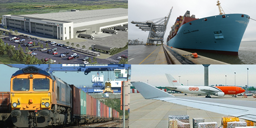

 

 
<h3>Essex's key multimodal logistics assets and benefits</h3>
<strong> Locations offering comprehensive, multimodal freight transport connectivity enable logistics businesses to increase efficiency while reducing costs, emissions and risk. And nowhere else in the UK provides businesses with more complete multimodal connectivity than Essex.</strong>

So, to demonstrate the fact, here are <strong style='line-height: 1.6;'>20 Reasons Why Essex is the UK’s Multimodal Gateway...</strong>

<strong style='line-height: 1.6;'>4 </strong><strong style='line-height: 1.6;'>Major Sea Ports, Handling all Cargo Types…</strong>

Essex’s 4 major sea ports – London Gateway, Tilbury, Harwich and Purfleet – offer large freight capacities, high-frequency deep-sea and short-sea services, and the ability to handle all types of cargo: Lo-Lo (containers), Ro-Ro (ferry), General, Dry Bulk, Liquid Bulk and Vehicles.

<strong>6 </strong><strong>Portside Rail Freight Terminals…</strong>

All of Essex’s sea ports benefit from portside rail freight terminals, providin

g businesses with high-frequency rail-freight connections to both UK and European markets and distribution hubs. These include the UK’s largest rail freight terminal – at London Gateway – and 3 rail freight terminals at the Port of Tilbury.

<strong style='line-height: 1.6;'>3 </strong><strong style='line-height: 1.6;'>Tri-modal, Portcentric, Large-Scale Logistics Development Sites…</strong>

Essex offers significantly more land for portcentric logistics developments than competitor deep sea port locations in southern England. Together, the key sites of <a href='http://www.londongateway.com/logistics-park/'>London Gateway Logistics Park</a>, <a href='http://www.londondistributionpark.com/'>London Distribution Park</a> and <a href='http://www.thamesenterprisepark.co.uk/'>Thames Enterprise Park</a> represent more than 1000 acres of portcentric, tri-modally (sea, rail and road) connected development land, more than 600 acres of which is ‘ready to go’ or has planning permission in place.

<strong style='line-height: 1.6;'>6 </strong><strong style='line-height: 1.6;'>London Airports Within Easy Reach…</strong>

All of London’s 6 airports can be accessed within 1 hour 30 minutes HGV drive time [1] of Essex’s key logi

stics sites. These include London Stansted (STN), within 1 hour, the UK’s 3rd largest air cargo hub (200,000 tonnes p.a.) and London Heathrow (LHR), the UK’s no. 1 air freight hub (1.5m tonnes p.a.). Both airports offer services to all major worldwide air freight hubs, with Stansted currently only operating at around 50% of full capacity. [2]

<strong style='line-height: 1.6;'>One </strong><strong style='line-height: 1.6;'>Well-Connected Location for UK Road Distribution!</strong>

The M25 London Orbital Motorway can be accessed within 30 minutes’ HGV drive time of Essex’s key logistics sites [1], providing businesses with fast, effective road access to major UK markets and distribution hubs. Central London can be accessed within 1.30 hours, Birmingham and Bristol in less than 3 hours, and Liverpool, Manchester and Leeds in 3.30 to 4 hours.

<strong style='line-height: 1.6;'>And, what’s more, distribution from Essex’s portcentric logistics sites is proven to deliver <u>substantial cost savings</u> to logistics businesses serving the UK market! </strong>

<strong>FIND OUT MORE</strong>

Contact<strong> <a href='../index.html' target='_blank'>INVEST Essex</a> </strong>to find out more about the advantages of UK Multimodal Gateway: Essex for your logistics or distribution operation.

Sources: [1] Thurrock sites, Google Maps, 2015 [2] CAA: UK Civil Aviation authority, 2014
