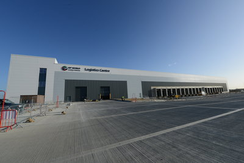

===
heading: Eddie Stobart Announces New Base at DP World London Gateway
url: eddie-stobart-announces-new-base-at-dp-world-london-gateway
sectors:
  - uk-multimodal-gateway-essex 
pubdate:16/10/2015
Author:Jacinda
thumb://investessex.co.uk/uploads/blog/Stobart_lorry_mini.jpg
heroimg:
contact:Robert Edge
===

Eddie Stobart has announced they are setting up a new container transport base at DP World London Gateway. Eddie Stobart decided to locate their new base at DP World London Gateway to support their business growth.

The strategic position of the base will allow the transport firm to be located closer to the midlands and the biggest consumer market in the UK, London. This will allow the company to provide new and existing customers with competitive container transport solutions from the south of the UK for which they are renowned in the north.
<h3>Strategic positioning assisting an efficient supply chain</h3>
Located just 25 miles from central London, and with 16 million consumers within 50 miles, Eddie Stobart’s new base at DP World London Gateway will offer a strategic operational base to support the company’s growth plans in the south of the country. This location will allow Eddie Stobart to serve destinations across the UK, via the port’s road and rail solution, thereby reducing mileage and costs as well as increase supply chain reliability.
<blockquote>
“We see the potential at DP World London Gateway and the opportunity to offer our customers greater cost efficiencies and environmentally friendly supply chain solutions. As a multimodal transport and warehouse provider, we believe that London Gateway provides a natural strategic fit with the growth plans for our business. We look forward to working in partnership with the DP World team so that we can jointly offer world class transport solutions.” Alex Laffey, CEO, Eddie Stobart
</blockquote><h3>Europe’s largest logistics park</h3>
London Gateway Logistics Park is located just to the east of DP World’s London Gateway Port, where a 560 acre area of land is under development which will become Europe’s largest logistics park. The logistics park has been planned to sit directly behind the dockside freight handling facilities and has full multi-modal transport infrastructure.
<blockquote>
“We are delighted to welcome Eddie Stobart Logistics to DP World London Gateway. It’s great to see a leading brand realise their growth plans here at Britain’s newest port and logistics park, which reduces costs from supply chains by allowing customers to ship closer and save money. We welcome Stobart’s commitment to provide competitive prices for deliveries into the UK market. The team are highly professional and I’m confident Eddie Stobart will provide UK cargo owners and shippers the very best in service and deliver real savings across the industry.” Simon Moore, CEO, DP World London Gateway
</blockquote><h3>DP World London Gateway – the UK's most advanced hub</h3>
Located just 25 miles from central London, DP World London Gateway has 16 million consumers within 50 miles enabling ships to enter the UK closer to the key areas of consumption such as London, Birmingham and Manchester. The port benefits from accessibility via sea, road and rail. Rail links have improved and there are now 11 destinations serviced by the port which offer a highly efficient alternative to road freight.

See <a href='http://www.investessex.co.uk/studies/place-studies/london-gateway-port/'>here</a> for more information on DP World London Gateway.

Source [<a href='http://eddiestobart.com/news/eddie-stobart-announces-new-base-at-dp-world-london-gateway'>Eddie Stobart</a>][<a href='http://www.londongateway.com/media-page/press-releases/eddie-stobart-announces-new-base-dp-world-london-gateway/' target='_blank'>DP World</a>]
