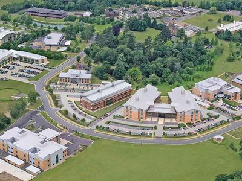
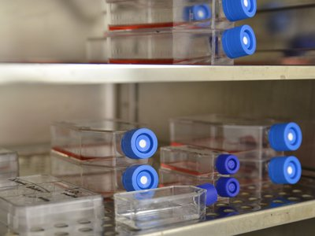

A stem cell technology company previously based in Cambridge has chosen to move to Essex. Axol Bioscience relocated to Chesterford Research Park to expand their business and take advantage of the location’s excellent access to London, Cambridge, the rest of the UK and Europe.
<blockquote>
“Chesterford Research Park is ideally positioned to offer us not only the space we need now, but also the opportunity for expansion in the future, which is incredibly important for us.

We looked at a variety of options. Chesterford stood out due to its location within the cluster, convenient access to major road, rail and air routes and proximity to some of the biggest pharmaceutical players in the industry.”

Yichen Shi, Chief Executive Officer, Axol
</blockquote><h3>About the company</h3>

Axol is a biotechnology company which specialises in the use of stem cell technology to produce human cell culture and growth supplements. Central to their business is an in-house research and development (R&amp;D) team who are able to introduce new products as well as supply a growing range of human primary cells.
<blockquote>
'Axol Bioscience has been a valued and important supplier to our lab’s research since the company was founded. The cells supplied to us by Axol represent exceptional value for money, but, most importantly, save us a great deal of valuable research time. Throughout our dealings with the company, service and support have always been excellent.”

Dr Paul Charlesworth, Physiology, University of Cambridge
</blockquote><h3>Relocating to the Chesterford Research Park</h3>
Chesterford Research Park is a 250 acre business park set in landscaped parkland with a focus on life sciences. It offers advanced laboratory and office space with facilities developed for biotechnology and pharmaceutical companies of all sizes.

The Science Village at Chesterford Research Park is an ideal base for Axol offering flexible, high quality self-contained accommodation in which they will be able to develop their R&amp;D and production. The R&amp;D suites are home to other pharmaceutical companies including:
<ul><li><a href='http://investessex.co.uk/studies/case-studies/biofocus-dpi'>Biofocus</a></li><li><a href='http://investessex.co.uk/studies/case-studies/biofocus-dpi' style='line-height: 1.6;'>​</a><a href='http://investessex.co.uk/studies/case-studies/illumina'>Illumina</a></li><li><a href='http://investessex.co.uk/studies/place-studies/chesterford-research-park'>Isogenica</a></li><li><a href='http://investessex.co.uk/studies/place-studies/chesterford-research-park'>Medivir</a></li><li><a href='http://investessex.co.uk/studies/place-studies/chesterford-research-park'>Xenovium</a></li></ul><h3>The London-Stansted-Cambridge corridor</h3>
Essex has strong life sciences sector and is an ideal place to locate a Life Sciences business. Half of existing firms in the sector have been located here for over ten years – and have no plans to leave.

Those companies tell us that there are a range of advantages to locating in Essex including . . .
<ul><li>Ideal strategic location, including proximity to London and Cambridge, and easy access to European and international markets</li><li>Excellent national and international infrastructure and transport systems</li><li>Access to a skilled labour market and Research and Development centres of excellence</li><li>Supportive national and local policy framework</li><li>Availability of high quality factory space</li></ul><blockquote>
“The London-Stansted-Cambridge corridor is the most exciting and dynamic business area in the UK and being able to distribute products globally is vitally important to allow companies in the region to grow and compete in the global market place.”

David Rooke, Inward Investment Manager, INVEST Essex
</blockquote>
<strong>How INVEST Essex can help companies</strong>

INVEST Essex, Essex County Council’s (ECC’s) Inward Investment department, promote the opportunities of one of the UK’s top business locations; Essex – close to London and with first class transport links, to businesses across the globe who could benefit from the county’s strategic location.

INVEST Essex works with its commercial partners to ensure that potential investors have the best service and are assisted at all points through their journey to move and set up in the UK.  They work with accountants, banks, solicitors, commercial relocation companies, fit out companies to give companies a quality end-to-end service and help them make the most out of their location decision.

See <a href='http://www.investessex.co.uk/'>here</a> for more information on INVEST Essex.

See <a href='http://investessex.co.uk/studies/place-studies/chesterford-research-park'>here</a> for more information on Chesterford Research Park.

Source [<a href='http://www.businessweekly.co.uk/news/biomedtech/new-axis-axol-move-chesterford#sthash.NTcIWmxN.dpuf'>Business Weekly</a>][<a href='http://www.axolbio.com/'>Axol</a>]
