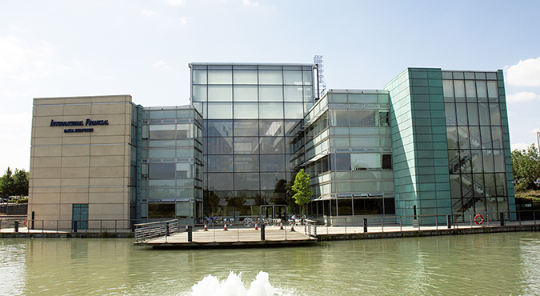
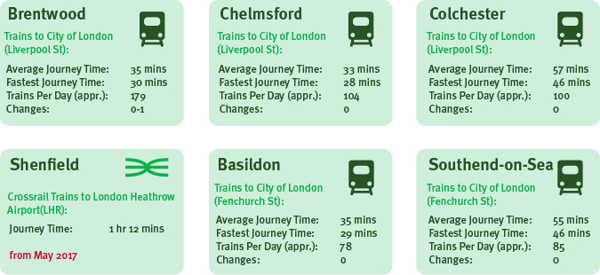

===
heading: Location Benefits for Financial & Professional Services Businesses
url: location-benefits-for-financial-professional-services-businesses
sectors:
  - london-essex-uk-finance-corridor 
pubdate:24/11/2015
Author:Paul Martin
thumb:
heroimg:
contact:Corinne Hearne
===

<h3>An Integral Extension Of London’s  World-leading Financial Services Cluster</h3>

<h3>Fast, Efficient Transport Connections to London &amp; The City: Unrivalled In The UK</h3>
<strong>Surface Transport Connections to London &amp; the City</strong>

<em>[Source: TheTrainline Europe, June 2015]</em>

<em>[Sources: CAA, Airports, Crossrail, Google Maps (Drive Times)]</em>

<!--EndFragment-->
<h3>Massive Property Cost Savings Versus London &amp; Major UK Cities</h3>
<strong>Essex: Office Rental Cost Savings</strong>

<h3>Saving Businesses £Millions Every Year On Office Rents Alone</h3>
<strong>Essex: Annual Rental Cost Savings (100k Sq Ft Prime Office)</strong>

<h3>Office Rental Costs That Are Stable, Not Rising</h3>
<strong>Prime Office Rents: Year on Year Change (July 2014 - June 2015)</strong>

<h3>A Large, Available Specialist Financial &amp; Professional Services Workforce</h3>
<strong>Access to Both Essex and London Financial Services Workforces  Unrivalled by UK Competitor Locations</strong>

<h3>Big Labour Cost Savings Versus London and the UK’s Major Cities</h3>
<strong>Essex Wage Cost Savings</strong>

<h3>Specialist Finance And ‘Big Data’ Research &amp; Education</h3>
<strong>Education and Research Expertise at the University of Essex</strong>

<h3>Chosen By Leading Financial &amp; Professional Services Businesses</h3>
<strong>Financial &amp; Professional Services Businesses Located in Essex</strong>

