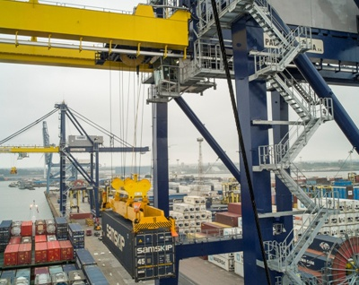

It has been a busy year in which the Port of Tilbury has seen continued expansion of the port estate. The port has doubled in volume size in the past ten years and plays a major role as an economic driver for the local area and for London as a whole. The impact of this investment has seen the Port of Tilbury create nearly 1,000 new jobs in 12 months. The port’s expansion includes…
<ul><li>A £20million refrigerated distribution centre at the London Container Terminal</li><li>London Construction Link alliance created to consolidate construction and waterborne transport on the Thames</li><li>The 70 acre London Distribution Park industrial &amp; logistics development</li></ul><h3>Expanding an efficient supply chain</h3>

The refrigerated distribution centre at London Container Terminal is targeted to be open for business in early 2016. It will create a unique portcentric distribution centre which will be one of the largest refrigerated (“reefer”) quayside facilities in Europe. Research identifies this facility will create value and efficiencies in the supply chain and make a considerable contribution towards minimising food miles.

Earlier this year the London Construction Link alliance between S Walsh and the Port of Tilbury was announced to highlight the role of construction consolidation and waterborne transport. A study by KLH Sustainability found that consolidating building material at the Port of Tilbury would result in a 48% reduction of heavy goods vehicle movements and 34% reduction of annual HGV kilometres travelled.
<h3>Minister visits to see impacts of port investment</h3>
The Port of Tilbury was recently visited by Parliamentary Under-Secretary of State for Transport, Robert Goodwill MP, who was shown the expansion of the port estate including London Container Terminal, one of the UK’s largest container terminals which together with the rest of the port, handles over half a million containers each year.

This month the port handled its one millionth freight unit with P&amp;O Ferries who operate a successful route at Tilbury to Zeebrugge. P&amp;O have seen an increase in volumes of almost 300% since the route was launched eight years ago.
<blockquote>
“This visit was a great opportunity for Tilbury to showcase the port's pivotal role in supporting the UK economy, from supplying construction materials for housing schemes across the South East and large infrastructure projects like Crossrail supporting the drive to improve recycling rates with the largest sorting and export facility in Britain.”

 Perry Glading, Chief Operating Officer at Forth Ports (Port of Tilbury owners)
</blockquote><h3>About the Port of Tilbury</h3>
The Port of Tilbury is one of the largest deep water ports on the River Thames and the closest port to the City of London. The Port of Tilbury specialises in construction transportation to London, import/export of timber, distribution of paper, and production and distribution of recycled products.

The port is a significant distribution centre covering over 850 acres and is well positioned to access the M25 orbital motorway and the rest of the UK's national motorway network. In addition, there are direct rail connections within the port, with access to the whole of the UK.

See <a href='http://investessex.co.uk/studies/place-studies/port-of-tilbury'>here</a> for more information on the Port of Tilbury.

Source [<a href='https://forthports.co.uk/media/releases/2955/Transport+Minister+Visits+Tilbury/'>Spreng &amp; Co</a>]
