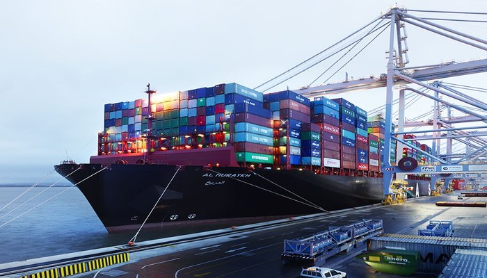

One of the world’s largest container ships, the United Arab Shipping Company’s (UASC) 400 metre long Al Muraykh, has docked at DP World London Gateway for its first port of call in Europe. The ship, which unloaded 3,800 containers at the port, was carrying a record 18,601 containers.

The port can already handle the world’s largest container ships and only last month received another one of the world’s largest vessels, the 399 metre long Munkebo Maersk. The Munkebo Maersk called at DP World London Gateway just weeks after the port announced the opening of a third berth. This berth will further increase deep sea access for ships carrying UK imports and exports.
<blockquote>
“As we enter 2016 in full swing, we look forward to opening berth three in the summer. The start of 2016 is seeing record volumes moving across the port, as customers and cargo owners benefit from the location of the UK’s 21st Century hub port, ensuring that supply chains are best protected and deliver the best environmental solutions.”

 Simon Moore, CEO, DP World London Gateway
</blockquote><h3>Offering an efficient supply chain</h3>
The Al Muraykh is currently the greenest vessel in the world and the recent voyage to DP World London Gateway marks a milestone in UASC’s environmental sustainability programme. Due to onboard technology and the ship’s ability to transport large volumes of containers to the UK this voyage saw CO2 reductions of 60%.
<blockquote>
“The UK is a key market for us and our customers there, like all our customers globally, are increasingly looking for sustainable, green transport solutions. The technology on board Al Muraykh and her sister vessels allow us to provide these solutions and help our customers achieve their own environmental targets.”

 Mr. Waleed Al Dawood, Chief Operating Officer, UASC
</blockquote><h3>DP World extending reach within the UK</h3>
Located just 25 miles from central London, and with 16 million consumers within 50 miles, DP World London Gateway is strategically placed to serve destinations across the UK, via the port’s road and rail solution, thereby reducing mileage and costs as well as increasing supply chain reliability.
<blockquote>
“This ship demonstrates the port can take any vessel afloat and provide world-class services to carriers. We are now focused on providing this world class service to cargo owners as cargo is collected. Trucks picking up containers are able to pick up faster and safer than ever before.”

 Simon Moore, CEO, DP World London Gateway
</blockquote><h3>The UK’s newest deep-sea terminal</h3>
Located just 25 miles from central London, DP World London Gateway has 16 million consumers within 50 miles enabling ships to enter the UK closer to the key areas of consumption such as London, Birmingham and Manchester. The port benefits from accessibility via sea, road and rail and has also developed innovative technology to ensure it remains open in bad weather.

See <a href='http://www.investessex.co.uk/studies/place-studies/london-gateway-port/'>here</a> for more information on DP World London Gateway.

Source [<a href='http://www.londongateway.com/media-page/press-releases/new-years-world-record-breaking-ship-arrives-dp-world-london-gateway-port/'>DP World London Gateway</a>]
