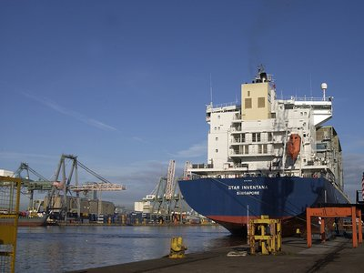

<h3>The importance of choice in transport planning…</h3>
Increasing globalisation, the growth of ecommerce and ‘just in time’ supply chains are putting pressure on logistics companies to deliver quicker, cheaper and more environmentally friendly transport solutions.  Multi-modal logistics models have developed to meet these demands [1].  

It’s not just about selecting the optimum form of transport for now, but also protecting your business against price and regulatory changes in the future.  Access to multiple transport modes helps logistics planners maximise efficiency and minimise costs, while maintaining supply chain integrity.
<h3>Cost and efficiency savings can be considerable….</h3>
A key benefit of multi-modal transport hubs is the ability to offer quick and efficient transfer between modes of transport. If, for example, it’s equally straightforward to transfer from a ship to either road or rail, then businesses have the flexibility to select the best option at any given time.  Furthermore, competition between transport operators drives down costs. And, because there’s always a choice of onward transport methods, costs can be minimised without compromising efficiency. 
<h3>Reduce your company’s risk….</h3>
The best way to future-proof a logistics business is to make sure it has choices.  There’s always the possibility of interruption to any given mode of transport, and for some cargo types even short delays can lead to financial penalties.  Locating at a multi-modal hub gives businesses the option to switch transport modes easily and quickly when the need arises.  And as prices fluctuate, having a choice of different forms of transport provides further financial protection.
<h3>…and your company’s emissions…</h3>
Environmental considerations are becoming ever more important in the logistics sector, and it’s recognised that some forms of transport are more environmentally friendly than others.  Multimodal connectivity gives the option of transporting goods onward by rail or sea wherever possible, making it easier for businesses to meet carbon emission targets. 
<h3>Essex – the UK’s Multimodal Gateway…</h3>
As a multi-modal hub, Essex delivers a freight transport infrastructure that’s unrivalled in the UK and in much of Europe. Not only does the county have four sea ports and six rail freight terminals, direct access to the M25 motorway and 6 airports within 90 minutes’ drive. It also has three deep sea international ports within 20 miles of central London – the business capital of Europe. As well as offering facilities for fast, efficient transfer between transport modes, Essex’s ports offer more than 1,000 acres of land for logistics development – either portside or port adjacent.

If your logistics business is seeking to make immediate gains in terms of costs and carbon footprint, and to future-proof its operations, there’s no better place in the UK to do it than Essex, the UK’s Multimodal Gateway.
<h3>Find Out More</h3>
Contact <a href='../index.html' target='_blank'>INVEST Essex</a><strong> </strong>to find out more about sites, people and support for your expanding logistics business in Essex, UK.

<strong>Sources</strong>: [1] Multimodal Transportation, Logistics, and the Environment: Managing Interactions in a Global Economy.  Rondinelli &amp; Berry. <em style='line-height: 1.6;'>European Management Journal </em>Vol. 18, No. 4, pp. 398–410, 2000
