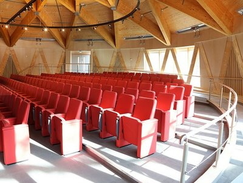

The University of Essex has further reduced its carbon footprint with the opening of a £21m carbon neutral business school. The building, which features sustainable elements including a ‘living’ roof, has its own micro-climate and has been designed to produce significantly lower carbon dioxide emissions.

The business school is part of the University’s largest expansion in its 50 year history and follows the opening of the £26m Silberrad Student Centre last year. The new business school, which will house a 250 seat lecture theatre and a new library, will also provide the University’s 13,000 students with computer terminals offering data, information and analytics direct from worldwide business company Bloomberg.
<blockquote>
“Our new home creates a collaborative environment where students, staff and business partners can work together to solve global business challenges. The fantastic learning spaces we now have will also help our students develop the knowledge, skills and integrity to flourish in a global marketplace. This beautiful new building is a centre of excellence for education and research in business.”

 Professor Geoff Wood, Dean, Essex Business School
</blockquote><h3>Attracting exceptional scholars</h3>
The opening of the business school comes at a time when the University has just been ranked the 5th most international university in the UK according to the <a href='https://www.timeshighereducation.com/world-university-rankings'>Times Higher Education</a> (THE). The University has also been ranked 21st overall in <a href='https://www.timeshighereducation.com/world-university-rankings' target='_blank'>THE’s list of the top 200 most international universities in the world</a>.

The investment in new teaching, research and living facilities is part of the University’s ongoing recruitment drive for outstanding scholars and THE’s rankings are a reflection of the University of Essex’s global intake. The University attracts students from more than 130 countries with international students making up 40% of the student body. The University also attracts leading academics and collaborates with prominent institutions from around the world.
<blockquote>
“These rankings show we are a genuinely international community attracting outstanding staff and students from every corner of the world. An international outlook is in our DNA with our teaching and research focused on global issues and challenges. We are also proud to have a reputation for forging successful collaborations with international colleagues across the globe.”

 Professor Anthony Forster, Vice-Chancellor, University of Essex
</blockquote><h3>Business links at the University of Essex</h3>
The Essex Business School based at the University of Essex is the largest business school in the county and offers continuous professional development whilst utilising business links through the adjacent Knowledge Gateway research park.

These business links offer opportunities to work with the University to drive innovation to create new jobs, increase productivity in the public and private sector, and generate growth.
<blockquote>
'We know working collaboratively with businesses across the East of England is key to our success – and through investments like the new Essex Business School building on our Knowledge Gateway, we are really keen to play our full part in the region.'

 Professor Anthony Forster, Vice-Chancellor, University of Essex
</blockquote>
See <a href='http://investessex.co.uk/studies/place-studies/university-of-essex'>here</a> for more information on the University of Essex.

Source [<a href='http://www.essex.ac.uk/events/event.aspx?e_id=9497'>University of Essex</a>]
