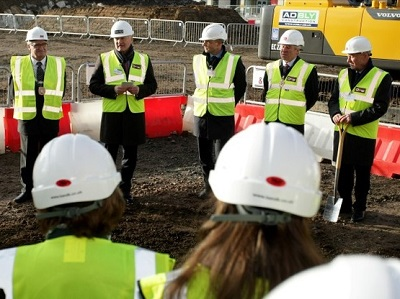

<strong>John Lewis Chelmsford is now open - see <a href='john-lewis-opens-first-essex-store#.V_IrzogrLIU'>here</a> for more info.</strong>

Developers Aquila Holdings have celebrated laying the final external stone block at a “topping out” ceremony for the £120m John Lewis development in Chelmsford. The development, due for completion in Autumn 2016, will bring a retail and leisure offer to Essex previously only available in London.

John Lewis is the anchor tenant in the 300,000 sq ft ‘Bond Street’ shopping and leisure  development and the department store’s first site in Essex. John Lewis has been among Britan’s top performing retail businesses, partly due to a strong online operation and the chain’s modern stores many of which are in the south east of England.The chain of department stores has been the best performer in Britain’s retail sector for the last six years. The new Chemsford store will further strengthen John Lewis’s position in the market.
<blockquote>
'This will be John Lewis' first site in Essex and is set to be one of the most modern shops in our portfolio, bringing together the very best of our services.

Bond Street will play a central role in Chelmsford's future and 2016 is set to be a landmark year for everybody here today. The city matches John Lewis perfectly.”

 Tim Harrison, Director of Store Development, John Lewis
</blockquote><h3>An unrivalled retail and leisure offer</h3>
Well known retailers have already taken space within the ‘Bond Street’ development. These include Monsoon, Hugo Boss clothing, L’Occitane, Joules, Fat Face and Goldsmiths. Britain’s most famous bookstore Foyles will open their first East of England branch, a 4,300 sq ft store in 'Bond Street'.
<blockquote>
“We are looking forward to bringing the Foyles experience to Chelmsford in September and to joining such an impressive lineup of retailers that are making the move to ‘Bond Street’. Customers can expect to enjoy an extensive range of books, stationery and gifts, as well as exclusive author events, family activities, and of course our renowned service from experienced booksellers.”

 John Browne, Finance Director and Head of Real Estate, Foyles
</blockquote>
The ‘Bond Street’ development has been designed to complement the current retail offer in Chelmsford. It will provide an open-air shopping environment with landscaped public space, a luxury cinema and riverside restaurants including Bills, Ask, Las Iguanas, Byron and Coast to Coast.
<h3>The UK’s newest city</h3>
Research done for the project by property consultants, Aquila, showed that Chelmsford is a very affluent area and the development will have an enormous reach. According to demographic data specialists, <a href='http://www.caci.co.uk/integrated-marketing/consumer-data'>CACI</a>, the Bond Street development will see spending in Chelmsford increase by 27% and will elevate the city to a ‘Premium Major Centre’ to take it alongside other major shopping destinations such as York, Maidstone, Solihull and Tunbridge Wells.
<blockquote>
'It's a very positive endorsement of the city and a clear testament to the strength and quality of the new destination we are creating.”

 Tony Chambers, Chairman, Aquila
</blockquote><h3>Benefits of Chelmsford</h3>

The city of Chelmsford is an ideal business location on the doorstep of London and Cambridge and with excellent access to Europe. The city has a fast railway link to London and offers easy access to London Stansted Airport.

Chelmsford has also been ranked as one of the best places to live in Britain coming 25th in Halifax’s annual <a href='http://www.lloydsbankinggroup.com/globalassets/documents/media/press-releases/halifax/2015/quality-of-life-2015-final.pdf'>Quality of Life survey</a> for a second year running. The survey measures living standards based on factors such as education, employment, environment and health.
<ul><li>There are 51% more ‘Wealthy Executives’ (CACI’s highest affluence group) in Chelmsford than the national average</li><li>The UK’s newest city has 8,000 new homes planned or under construction</li><li>Chelmsford is home to the busiest railway station in the East of England with over 7m passengers a year</li><li>It has a thriving economy with over 11,000 businesses and 80,000 jobs contributing £3.4 billion to the national economy</li><li>Chelmsfordians are also among the UK's healthiest, with men and women living beyond the UK average age for life expectancy</li></ul>
Source [<a href='http://www.essexchronicle.co.uk/John-Lewis/story-28625163-detail/story.html#ixzz3ycjhenMY'>Essex Chronicle</a>] [<a href='http://www.caci.co.uk/integrated-marketing/consumer-data'>CACI</a>] [<a href='http://www.lloydsbankinggroup.com/globalassets/documents/media/press-releases/halifax/2015/quality-of-life-2015-final.pdf'>Halifax</a>] [<a href='http://www.bondstreetchelmsford.co.uk/info.html'>Bond Street Chelmsford</a>]
