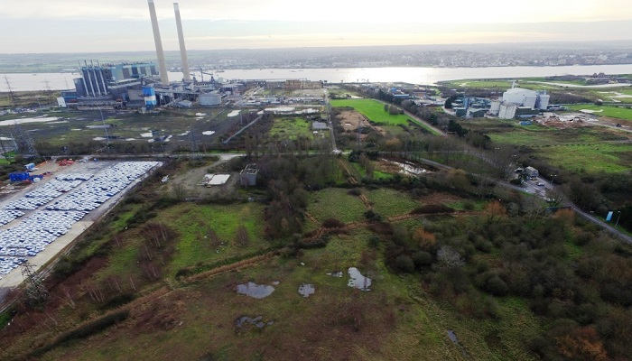
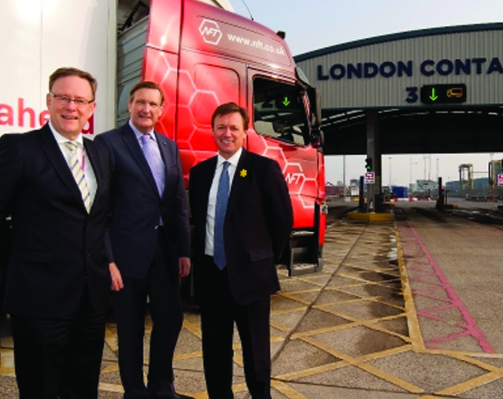
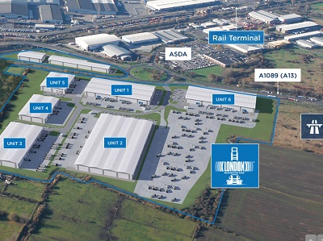

The Port of Tilbury has entered into an agreement to purchase 152 acres of land including a deep water jetty on the site of the former Tilbury Power Station. The port will invest at least £100m in infrastructure and facilities on the land.

The land acquisition will bring the total acreage of the port to 1,100 acres, the equivalent of a 25% expansion of the current port. As part of this expansion, the Port of Tilbury owners, Forth Ports, intend to create a new port to meet their customers needs and market demands.
<blockquote>
“This is a significant land acquisition for the Port of Tilbury. As London’s major port, it is a key resource for companies who need to access London and the South East of England.  We are acquiring this additional land to extend the port in response to increasing demand from customers who are seeking additional capacity within the port.”

 Charles Hammond, Chief Executive, Forth Ports
</blockquote><h3>Expanding an efficient supply chain</h3>
The port has doubled in volume size in the past ten years and plays a major role as an economic driver for the local area and for London as a whole. The port’s expansion includes…
<ul><li>A £20million refrigerated distribution centre at the London Container Terminal</li><li>London Construction Link alliance created to consolidate construction and waterborne transport on the Thames</li><li>The 70 acre London Distribution Park industrial &amp; logistics development</li></ul><blockquote>
“We have an ambitious growth plan for the Port of Tilbury and this land deal will complement our other development projects at the port including the growth of London Distribution Park and the opening this year of the UK’s largest port-based chill store, operated by our partners NFT.”

 Charles Hammond, Chief Executive, Forth Ports
</blockquote><h3>A significant distribution centre</h3>
Forth Ports intend for the new port facility to be connected to the national rail and road networks. The port is already a significant distribution centre covering over 850 acres and is well positioned to access the M25 orbital motorway and the rest of the UK's national motorway network. In addition, there are direct rail connections within the port, with access to the whole of the UK.
<blockquote>
“This is a really important development.  The former power station site offers a fantastic deep water berth and the land is ideal for the port centric logistics in which Tilbury specialises.  It’s all part of a picture of growing trade on the Thames, which we are actively supporting through the Thames Vision project.”  

Robin Mortimer, Chief Executive, The Port of London Authority
</blockquote><h3>About the Port of Tilbury</h3>
The Port of Tilbury is one of the largest deep water ports on the River Thames and the closest port to the City of London. The Port of Tilbury specialises in construction transportation to London, import/export of timber, distribution of paper, and production and distribution of recycled products.

Source [<a href='https://forthports.co.uk/media/releases/3066/Expansion+plans+announced+for+Port+of+Tilbury/' target='_blank'>ForthPorts</a>]
