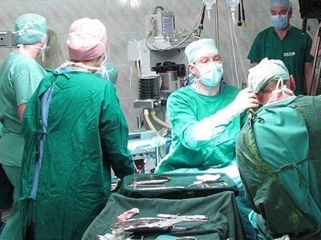
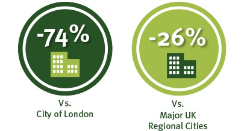

<a href='../index.html' style='line-height: 1.6;' target='_blank'>INVEST Essex</a> works directly with companies seeking to identify a profitable business location in the UK/Europe enabling them to take full commercial advantage of the UK’s largest market opportunity as quickly and efficiently as possible from one of the best connected locations in the UK. 

Property and associated costs are always high on the agenda when companies consider relocation projects.  According to Colliers (2015), £5million a year in rent alone can be saved by a company relocating to a 100,000sq ft office from the City of London to Essex. The same accommodation would cost £662,000 less per year in Essex than in the UK’s regional core cities [1]. INVEST Essex can highlight the significant cost advantages of Essex to their clients.
<h3>Finding the best property solution</h3>
INVEST Essex (IE) works with UK and foreign based companies helping them settle in Essex and thrive in a location on the doorstep of London and Cambridge. IE has recently been working with two companies to expand and settle in the county…

Skilful.co, a specialist online training company, took advice from INVEST Essex on the best property solution for their needs when they realised they needed space in which to expand. After having been presented a number of property options the company have been able to relocate whilst still retaining a base in Black Notley, Essex, where they can consolidate their life management and professional skills business, Skilful.co.

Contact the INVEST Essex team <a href='../how-we-can-help' target='_blank'>here</a> to find a property solution for your business.
<h3>Integrating into the local MedTech sector</h3>
INVEST Essex provides a free, bespoke and confidential service providing professional advice, guidance and intelligence to companies through every aspect of locating and doing business from the Essex/UK. When Australian medical device company, Fairmont Medical, were looking to establish a new UK office to expand their surgical and critical care equipment business INVEST Essex recommended Chelmsford, Essex, in which to base themselves.

Fairmont Medical were keen to integrate into the local medical technologies (MedTech) sector and INVEST Essex advised that Chelmsford, home to MedBIC, the Anglia Ruskin University Business Innovation Centre for Medical and Advanced Engineering, would be an ideal fit for them. The £6 million MedBIC centre is recognised for its work with early stage medical technology businesses providing support, help and speeding commercial ideas to market.
<h3>Essex – a premier business location</h3>
Essex, the biggest economy outside London or Manchester, is a cost advantageous location for international companies wanting a UK base. The county is one of the UK’s premier business locations, bordering both Cambridge and London, Europe’s no.1 investment location. There are key areas which are attractive to businesses…
<ul><li>Extending eastwards from the City, the London-Essex UK Finance Corridor combines fast, easy access to London’s finance hub, offering a large, high-quality local workforce and massive savings on office rental costs</li><li>The Harlow Enterprise Zone and Chesterford Research Park are highly attractive propositions to advanced manufacturing and engineering, pharmaceuticals, Med Tech, healthcare and ICT (Information and Communications Technology) industries</li><li>There is over 1,000 acres of available, tri-modal, portcentric land for logistics businesses</li></ul><blockquote>
“Essex is an ambitious marketplace full of creative businesses looking to succeed and grow. The county is also home to two major airports plus Harwich International Port, the Port of Tilbury and Thames Gateway, and with close proximity to London, the international potential for these companies is huge.”

 Tim Blois, Corporate Finance Director, Grant Thornton
</blockquote><h3>How INVEST Essex helps companies relocate within the county</h3>
INVEST Essex, Essex County Council’s inward investment team, works with companies both in and out of Essex, typically foreign businesses, to help them to expand or establish a base in the UK.  This has valuable economic benefits to the county bringing in foreign investment and creating employment opportunities.

As well as offering no fee introductions to people with the right knowledge and expertise to assist companies with their move in the county, INVEST Essex also offers a free commercial property search. This search contains up to date listings of properties within Essex. Property information can be downloaded or enquired about at the click of a button.

Contact the INVEST Essex team <a href='../how-we-can-help' target='_blank'>here</a> to find a property solution for your business.

[1] Based on an average of rents across the Core Cities

 

