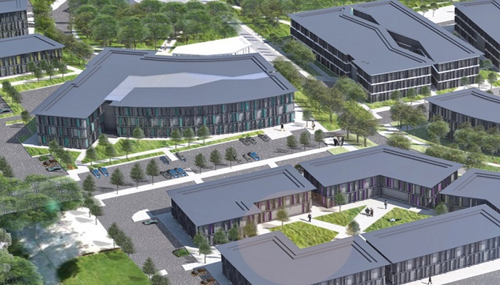
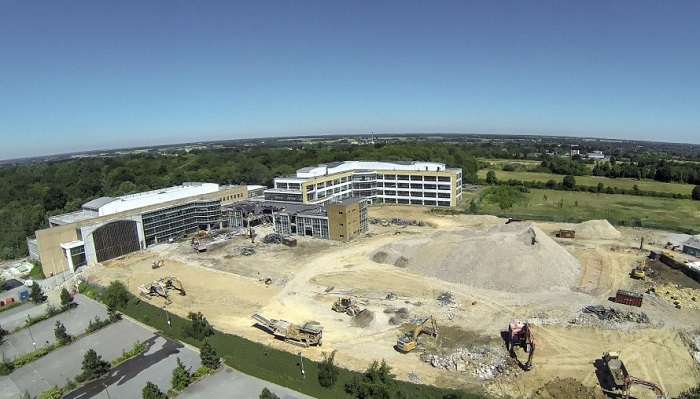

Opportunities in Essex for companies operating in the life sciences and medical technologies (MedTech) fields have just increased with the announcement of a MedTech Innovation Centre within a new science park in Harlow. The Innovation Centre, which is due to open in 2017, will be part of one of the world’s largest health innovation spaces for companies of all sizes.

The new Innovation Centre will be an important element of the London-Stansted-Cambridge corridor (LSCC)  and follows the announcement of the £350million move by <a href='public-health-england-to-move-labs-to-essex#.VubNy32LTIU' target='_blank'>Public Health England</a> to Harlow and <a href='Stem-cell-company-relocate-to-Essex#.VubOAn2LTIU' target='_blank'>Axol Bioscience</a>’s move to Chesterford Research Park. The LSCC corridor accounts for 11% of all national employment in the life sciences sector and currently houses 635 life sciences businesses.
<h3>Science park campuses to attract international investment</h3>
The (multi-million pound) deal for the new Innovation Centre was signed between Anglia Ruskin University (ARU) and Essex County Council (ECC). The £5m ARU project, supported by a £2.5m grant from ECC, is part of a vision to establish  MedTech Campus science parks at Chelmsford, Harlow and Southend, of which the Harlow MedTech Innovation Centre will form a part.

The science park campuses aim to attract international and national companies around the innovative medical technology sector. Investment in the campuses will help to establish Essex, and the UK, as a global leader in this sector.
<blockquote>
“We are delighted to be working in partnership with Essex County Council to develop collaborative facilities for innovative businesses looking to start up in or relocate to Essex. The Harlow MedTech Innovation Centre will boost the development of our MedTech Campus, creating one of the largest health innovation spaces in the world.”

 Professor Michael Thorne, Vice Chancellor, Anglia Ruskin University
</blockquote><blockquote>
“Essex County Council is pleased to be working with Anglia Ruskin University on this important project. The Medtech Innovation Centre will provide new opportunities for research and academic collaboration.”

 Councillor Kevin Bentley, Deputy Leader of Essex County Council and Cabinet Member for Economic Growth, Essex County Council
</blockquote><h3>Becoming a global market leader</h3>
The Innovation Centre will be part of the Harlow Enterprise Zone which includes Kao Park currently being developed into a business park and data centre campus.

The 25 acre science park, which will incorporate the Innovation Centre, consists of 500,000sq ft of buildings and is being developed by Vinci Developments, part of Europe’s largest construction company. The science park is expected to act as a catalyst attracting companies to the wider 51 hectare Enterprise Zone (EZ) in Harlow.
<blockquote>
“We are delighted that VINCI has been appointed as the preferred development partner given their expertise and the experience of major projects they bring. They will enable us to create a high quality environment for high technology businesses and ensure that the new Harlow Science Park becomes a market leader in the London Stansted Cambridge Corridor.”

 John Keddie, Chairman, Harlow Enterprise Zone Board
</blockquote><h3>Largest life science cluster in Europe</h3>
The London Stansted Cambridge corridor is the largest life science cluster in Europe and a leading UK and European hub for…
<ul><li>Research, development and manufacturing of medical devices</li><li>Biotechnology</li><li>Pharmaceutical products and preparation</li><li>Research in natural science and engineering</li></ul><h3>Growth opportunities and cost savings in the region</h3>
With major life science clusters in Chelmsford, Harlow, Southend and Great Chesterford there is a strong and growing supply of high quality office space in Essex. The expansion of the Harlow EZ illustrates the growth opportunities in the life sciences and MedTech sector in the region with the Harlow EZ a highly attractive proposition to businesses.

In comparison to other life science centres in the UK and Western Europe, Essex is up to 30% cheaper with regards to labour costs for a typical life science research and development (R&amp;D) centre, and up to 85% cheaper with regards to office costs.
<h3>About Harlow</h3>
Harlow is a superb location for business, located between London and Cambridge, with the Enterprise Zone site less than 5 minutes from the M11. Fast train connections mean that London Liverpool Street can be reached in 35 minutes. The town is just 15 minutes from Stansted Airport with its extensive connections throughout Europe and its global freight business.

More information here on the <a href='http://investessex.co.uk/studies/place-studies/harlow_enterprise' target='_blank'>Harlow Enterprise Zone</a>, <a href='http://investessex.co.uk/studies/place-studies/chesterford-research-park' target='_blank'>Chesterford Research Park</a>, the <a href='med-tech-research-and-development-in-essex#.VuaUrH2LTIU' target='_blank'>MedBIC Business Innovation Centre for Medical and Advanced Engineering</a>

Source [<a href='http://www.essex.gov.uk/News/Pages/New-Harlow-MedTech-Innovation-Centre-to-attract-businesses-and-jobs-to-Essex.aspx' target='_blank'>ECC</a>] [<a href='http://harlowez.org.uk/?p=953' target='_blank'>Harlow EZ</a>]

 

