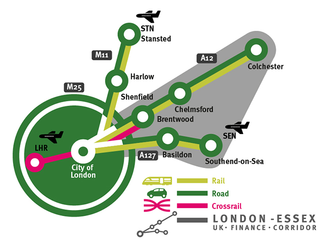

 London is a world-leading centre of Financial and Professional Services and ‘Europe’s Business Capital’ [1]. But what, precisely, is the key to the city’s success? And what does this mean for financial services businesses considering lower cost UK locations beyond the London hub? [2]
<h3>The Key to London’s Success in Financial Services: Agglomeration</h3>
One word, perhaps more than any other, explains why London has grown to be the Financial Services powerhouse it is today. And that word is ‘agglomeration’. But what does it really mean?

In summary, agglomeration is the concentration of an industry’s skills, markets, services infrastructure and knowledge in one place, creating an environment that facilitates the sector’s sustained growth and prosperity.

In London, an established concentration of financial services businesses has attracted yet more companies seeking specialised suppliers and customers. And it has attracted the sector’s best workers in large numbers, seeking a broad range of opportunities for career progression. These concentrations have had a number of virtuous effects that have stimulated a ‘snowball effect’ of further growth: the efficient matching of workers to job vacancies; increased competition, resulting in cost-effective, high quality services; an ‘atmosphere’ infused with financial knowledge and information – all reinforcing London’s competitive advantage as a financial services hub. [2]
<h3>But London’s Success Comes at a Price…</h3>
But there’s another effect of agglomeration that’s far less desirable for businesses: high costs, notably of properties and people. And there’s inevitably a point at which companies will decide that, for certain business functions and operations, being located in the London hub can no longer be justified on cost grounds.

Typically, this is the point at which hard decisions have to be made – weighing up the benefits of reducing overheads with the costs of locating away from London. And those costs can be significant: difficulties finding the right, skilled workers; losing the ‘face-to-face’ contact with suppliers and customers that binds business relationships; losing access to the knowledge and information networks that energise London’s financial services sector and continually build workforce expertise.
<h3>But There is Another Way…</h3>
The fact is that ensuring business competitiveness doesn’t have to involve a binary choice between high and rising costs in the London hub or the loss of London’s agglomeration advantages in lower-cost, more remote UK locations. Because London’s financial services sector reaches beyond the limits of the city into the capital’s hinterland, without respect for artificial administrative boundaries. And nowhere is this truer than in the case of the London-Essex UK Finance Corridor.
<h3>The Best of Both Worlds for Finance Businesses…</h3>

The London-Essex UK Finance Corridor extends eastwards from the City of London along major road and rail routes, incorporating the key Essex towns of Brentwood, Chelmsford, Colchester, Basildon and Southend-on-Sea. These towns provide businesses with transport connectivity to the City of London in as little as 28 minutes [3] combined with office rental costs that are 74% lower than those in the City [4]. Proximity to London delivers workforce benefits too: Essex’s large, local financial services workforce is complemented by highly skilled Essex-based London commuters, and access to London’s vast financial services labour pool.

The Corridor is, as such, an intrinsic extension of London’s world-leading financial services cluster, but without the ‘high-cost’ downside. That’s why it’s been selected as a business location by leading financial services companies including Liverpool Victoria, RSA, Cofunds, First Data and International Financial Data Services (IFDS).

And in an increasingly competitive business environment, with more focus on cost minimisation than ever before, the business case may well stack up for your company too.
<h3>FIND OUT MORE</h3>
Contact <a href='../index.html'>INVEST Essex</a> to find out more about property, people and support for your expanding financial services business in Essex, UK.

<strong>Sources:</strong> [1] Deloitte 2014. London Futures: London Crowned Business Capital of Europe [2] London’s Central Business District: Its Global Importance. GLA Economics, 2008 [3] The Trainline Europe [4] Colliers, 2015 [5] London's Place in the World of Finance: A Supply-side Approach: <a href='http://www.lboro.ac.uk/gawc/rb/rb60.htm'>http://www.lboro.ac.uk/gawc/rb/rb60.htm</a>
