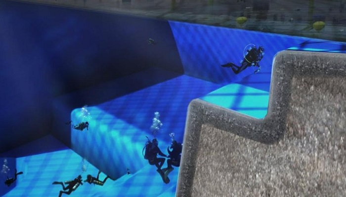
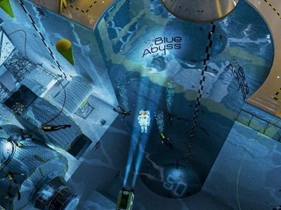
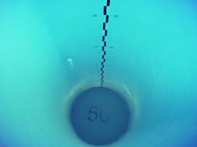
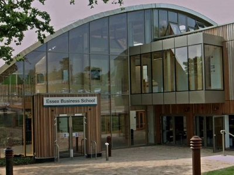

A virtual reality tour of the world’s deepest research pool, the Blue Abyss Project, backed by British astronaut Major Tim Peake, has just been released as the project moves one step closer to development at the University of Essex.

The University is in exploratory discussions to build the world's deepest swimming pool for spaceflight and human endurance research. Construction on the Blue Abyss Project is expected to take 18 months to two years. It will become Europe’s top marine and space research facility.
<blockquote>
“We have been in discussions about the pool with both the European Space Agency and the Chinese authorities. We want this to be a global facility.”

 John Vickers, Managing Director, Blue Abyss
</blockquote><h3>Strategic location for research and development</h3><iframe allowfullscreen='' frameborder='0' height='350' mozallowfullscreen='' src='https://player.vimeo.com/video/161771683' webkitallowfullscreen='' width='625'></iframe>
<a href='https://vimeo.com/161771683'>BlueAbyss_by_Cityscape_v1</a> from <a href='https://vimeo.com/user50850750'>Blue Abyss Research Facility</a> on <a href='https://vimeo.com &lt;https://vimeo.com/&gt; '>Vimeo</a>.

The proposed 50m deep pool at the University’s campus in Colchester will be deeper than NASA's own 12m deep training pool in Houston and deeper than the world's current deepest pool, the 42m “Y-40” diving pool in Padova, Italy. It will simulate the microgravity of outer space and deep-sea environments used to train astronauts &amp; deep sea divers.

The proposed £40m pool would be located at the University of Essex’s Knowledge Gateway research and business park, close to the London-Stansted-Cambridge economic corridor, and within easy reach of the offshore wind industry conducted through Harwich, one of the most experienced wind ports in the UK.
<blockquote>
'All the ingredients are here; the location near to Stansted Airport and the North Sea offshore industry via Harwich; a superb campus site and an excellent research base within the University's academic departments.'

 John Vickers, Managing Director, Blue Abyss
</blockquote><h3>World leading research facility</h3>
The team working with Blue Abyss includes Professor Walter Kuehnegger, one of NASA’s Apollo Lunar Exploration Principle Investigators, who has joined as a consultant. Major Tim Peake, the European Space Agency astronaut, has also backed the project.
<blockquote>
“I support Blue Abyss and see this future facility as something that does not yet exist in Europe and that would compete with, or potentially even surpass, what is available in the United States and Russia.”

 Major Tim Peake, Astronaut, European Space Agency
</blockquote>
The pool will complement the University of Essex’s work in monitoring water quality, marine conservation and data analytics.
<blockquote>
“The digital depiction of the pool brought my vision to life. People can now see what I've been thinking about and if this facility can help young people get more involved or interested in our marine environment then that would be great.'

 John Vickers, Managing Director, Blue Abyss
</blockquote><blockquote>
“Most people will already know about our work with robotic fish to monitor water quality, but our Human Performance Unit is also based at our Wivenhoe Campus and we have many other specialisms which complement this project including psychology, marine conservation and of course data analytics which underpins all of these areas.”

 Bryn Morris, Registrar, University of Essex
</blockquote><h3>University investment in growth</h3>
The University of Essex is currently undergoing its largest expansion in its 50-year history. It is investing in new teaching, research and living facilities and has recently opened a £26m student centre and a £21m business school. The proposed pool project would further enhance the University of Essex’s offer.
<blockquote>
“Many elements of this project fit very well with our strengths as a university. What also really interests us in this proposal are the business engagement and SME spin-out opportunities that could be generated from this development and we look forward to working alongside Blue Abyss to see how it can be delivered.”

 Bryn Morris, Registrar, University of Essex
</blockquote>
About the University of Essex Knowledge Gateway

The Knowledge Gateway at the University of Essex is a business community where experts can collaborate, ideas are developed and businesses are enabled to prosper and drive business forward across a range of sectors.

Source [<a href='http://www.bbc.co.uk/news/uk-england-essex-35978670'>BBC News</a>] [<a href='http://www.blueabyss.uk/index.php/news-section/blue-abyss-blog/665-one-step-closer'>Blue Abyss</a>]

See <a href='http://www.investessex.co.uk/studies/place-studies/university-of-essex/'>here</a> for more info on the University of Essex
