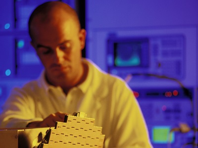

Everyone with an interest in the technology sector has heard of the UK’s ‘Cambridge Cluster’. According to the University of Cambridge, the city is home to ‘Europe’s largest technology cluster’, with more than 50,000 people employed by around 1,500 technology-based firms. Together, these companies generate annual revenues in excess of £13 billion [1].

So isn’t it a little audacious to speak of the Cambridge-Essex UK High-Technology Cluster?
<h3>It certainly seems so, until you look at the facts…</h3>
Essex is the county adjacent to Cambridgeshire, providing businesses with direct access to all the world-class research and knowledge that Cambridge has to offer. But Essex’s high-technology sector is far more than just a spill over of the Cambridge Cluster.

According to ONS data [2], Essex is home to some of the highest concentrations of high-technology industry in the UK. For advanced electronics manufacturing, the key Essex locations of Harlow and Maldon show higher industry concentrations than both Cambridge and South Cambridgeshire (home to several of the Cambridge Cluster’s science and technology parks). For ‘medical instruments manufacturing’, Harlow and Southend (also in Essex) surpass South Cambridgeshire. In summary, there’s a single, contiguous Cambridge-Essex UK High-Technology Cluster, and Essex is a powerful partner within it.
<h3>Always at the forefront of advanced electronics technologies…</h3>
To put it simply, Essex is a leading location for advanced electronics businesses because it always has been. The county’s leadership in radio frequency-based technologies started with Marconi at the end of the nineteenth century. And it continues to this day, with companies including BAE Systems, Finmeccanica and e2v serving high-technology sectors including aerospace, defence, space, healthcare and advanced automotive. It may come as no surprise that many of these businesses can trace their Essex roots directly back to the Marconi Company.
<h3>The Essex high-technology advantage: added value with massive cost savings…</h3>
So, Essex has world-class high-technology credentials in its own right. But the county also offers cost and connectivity advantages that, together, make it the location of choice for expanding high-technology businesses.

From strategic Essex locations like Harlow Enterprise Zone (M11, junction 7), both London and Cambridge can be accessed by road in less than 1 hour [3]. That means direct access to Europe’s business capital, two global technology hubs and three of the world’s ‘top ten’ ranked universities (Cambridge, University College London and Imperial College London – all excelling in engineering, electronics and ICT research).

And, uniquely within the UK, Essex combines these value-adding advantages with a significantly reduced cost base – delivering potentially massive property and labour cost savings versus Cambridge, London and other leading UK and European technology locations [4] [5]. That means that high-technology businesses can scale-up manufacturing and R&amp;D operations in an optimal location, without the high-cost downside. And it explains why leading businesses including Raytheon and Arrow Electronics are, right now, choosing to expand in Essex– at the heart of the Cambridge-Essex UK High-Technology Cluster.
<h3>FIND OUT MORE</h3>
Contact <a href='http://www.investessex.co.uk/' target='_blank'>INVEST Essex</a> to find out more about the Cambridge-Essex UK High-Technology Cluster.

<strong>Sources:</strong>

[1] University of Cambridge, Research: <a href='https://www.cam.ac.uk/research/innovation-at-cambridge/the-cambridge-cluster' target='_blank'>https://www.cam.ac.uk/research/innovation-at-cambridge/the-cambridge-cluster</a> [2] ONS, Location Quotients by Industry, 2011 (SIC Codes C26 and C325) [3] Google Maps, 2015 [4] ONS, Nomis [5] Colliers, 2015: Comparison of prime office costs. Averages of all surveyed Essex, Cambridge &amp; London locations.
