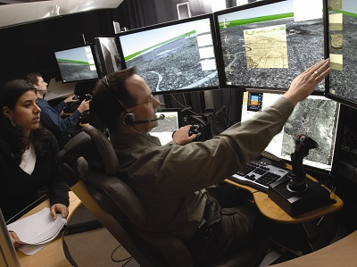

<h3>Essex is a leading UK and European location for high-technology companies…</h3>
According to UK government data [1], Essex is home to some of the highest concentrations of advanced electronics businesses in the UK. But what are the specific technology capabilities that make it the ‘location of choice’ for so many high-tech companies?

Serious players in the fields of aerospace and defence have based their research and development facilities in Essex, alongside smaller, niche companies that develop and produce advanced communications and electronics products. They’re all part of a high-technology cluster which has its roots in the county’s historical radio frequency technology specialism.
<h3>It all started with Marconi, and the legacy endures…</h3>
<a href='http://investessex.co.uk/studies/case-studies/birthplace-of-radio'>Marconi built his first radio factory in Chelmsford</a>, Essex, in 1898, and Marconi’s Wireless and Signal Company was the first to transmit a radio signal across the Atlantic. The Marconi Research Laboratory went on to play a foundational role in the research and development of broadcasting, communication satellites, radar, semi-conductors, sensors, microelectronics and avionics.  The legacy endures - Marconi’s laboratory is now part of BAE Systems’ research and development facility. Other high technology firms including Selex ES and e2V, which maintain their own substantial research and development facilities in Essex, also have their origins in the Marconi group.
<h3>Applying expertise across high-technology market sectors…</h3>
Between them, companies in the Cambridge-Essex UK High-Technology Cluster have an enviable range of expertise in information and communication technologies, control systems, semi-conductor technology, sensors, imaging, advanced and autonomous robotics and precision design and manufacture. These technologies are applied across market sectors including aerospace, defence, space, medical and advanced automotive. The design, research and development capabilities of the cluster’s businesses are complemented by related expertise in the nearby universities of Essex, Cambridge and London.
<h3>With specialisms based on advanced communications…</h3>
It’s unsurprising that companies with their roots in communication undertake research and development into the hardware and software that supports it.

Key specialisms include Control Systems and Advanced Autonomous Robotics, which rely on sophisticated and robust information and communication systems.  BAE Systems, Raytheon and Selex ES apply their expertise to applications including cockpit control and guidance systems, working alongside niche companies including Servowatch, which specialises in Ship control systems.  Associated technology is applied to our homes (smart systems) by Honeywell, another Essex based company.

Sensors sit at the interface between communication networks and people or things - another natural specialism for Essex.  Chelmsford-based e2V Technologies produces sophisticated image sensors used on a large number of space missions, including the Rosetta deep space probe.  BAE Systems applies sensor technology to biomedical research, as well as producing cutting edge solutions for the company’s more traditional aerospace market.

Advances in semi-conductor technology have been essential to meet demand for faster communication speeds, smaller devices and to cope with challenging environments. Essex-based Arrow Electronics, along with Raytheon and e2V, provide world-leading products to meet these challenges.
<h3>Adding up to a dynamic high-technology environment…</h3>
Marconi’s legacy has given rise to an impressive range of research, development and manufacturing capabilities, as well as a strong cross-sector culture. And it continues to be a key part of what makes Essex a ‘location of choice’ for advanced electronics businesses.
<h3>FIND OUT MORE</h3>
Contact <a href='../index.html' target='_blank'>INVEST Essex</a> to find out more about the Cambridge-Essex UK High-Technology Cluster.

<strong>Sources:</strong> [1] ONS, Nomis
