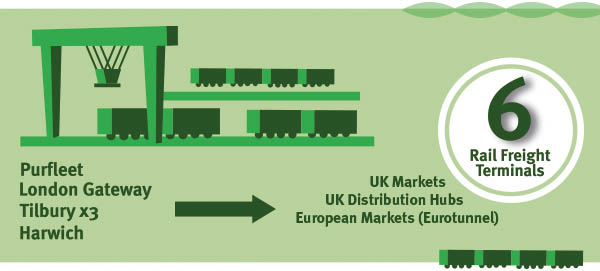
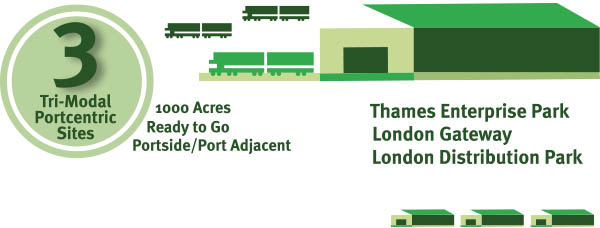
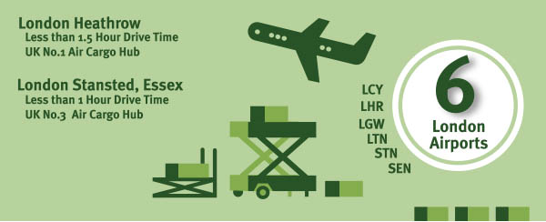

<strong>Essex’s unrivalled multimodal transport connectivity makes it ‘the UK’s Multimodal Gateway’ for logistics and distribution businesses.</strong>

<strong>Here’s why . . .</strong>
<h3>4 Major Sea Ports, Handling all Cargo Types</h3>
Essex has 4 major sea ports; London Gateway, Tilbury, Harwich and Purfleet. They offer large freight capacities, high-frequency deep-sea and short-sea services, and the ability to handle all types of cargo: Lo-Lo (containers), Ro-Ro (ferry), General, Dry Bulk, Liquid Bulk and Vehicles. 

<h3>6 Portside Rail Freight Terminals</h3>
All of Essex ís sea ports benefit from portside rail freight terminals, providing businesses with high-frequency rail-freight connections to both UK and European markets and distribution hubs. These include the UK ís largest rail freight terminal ñ at London Gateway ñ and 3 rail freight terminals at the Port of Tilbury.

<h3>3 Tri-modal, Portcentric, Large-Scale Logistics Development Sites</h3>
Essex offers significantly more land for portcentric logistics developments than competitor deep sea port locations in southern England. Together, the key sites of London Gateway Logistics Park, London Distribution Park and Thames Enterprise Park represent more than 1000 acres of portcentric, tri-modally (sea, rail and road) connected development land, more than 600 acres of which is ready to go or has planning permission in place.

<h3>6 London Airports Within Easy Reach</h3>
All of London ís 6 airports can be accessed within 1 hour 30 minutes HGV drive time [1] of Essex ís key logistics sites. These include London Stansted (STN), within 1 hour, the UK ís 3rd largest air cargo hub (200,000 tonnes p.a.) and London Heathrow (LHR), the UK ís no. 1 air freight hub (1.5m tonnes p.a.). Both airports offer services to all major worldwide air freight hubs, with Stansted currently only operating at around 50% of full capacity. [2]

<h3>One Well-Connected Location for UK Road Distribution!</h3>
The M25 London Orbital Motorway can be accessed within 30 minutes í HGV drive time of Essex ís key logistics sites [1], providing businesses with fast, effective road access to major UK markets and distribution hubs. Central London can be accessed within 1.30 hours, Birmingham and Bristol in less than 3 hours, and Liverpool, Manchester and Leeds in 3.30 to 4 hours.

And, what ís more, distribution from Essex ís portcentric logistics sites is proven to deliver substantial cost savings to logistics businesses serving the UK market! (add link to Article 5 Portcentric Distribution From Essex Can Save Your Business Money. 

<h3>FIND OUT MORE</h3>
Contact <a href='../index.html' target='_blank'>INVEST Essex</a> to find out more about the advantages of UK Multimodal Gateway: Essex

Sources: [1] Thurrock sites, Google Maps, 2015 [2] CAA: UK Civil Aviation authority, 2014
