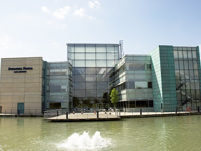

<h3>Finance IT Businesses and Data Centres can meet their need for high speed data transfer and save costs by locating in Essex…</h3><h3></h3>
When it comes to location, <a href='../sectors/london-essex-uk-finance-corridor' target='_blank'>Finance</a> IT businesses have some tough requirements. Very fast data transfer speeds and access to a highly specialised workforce are likely to be essential. And, because this is a sector that is constantly innovating to keep up with advances in both technology and the world of finance, they also need to maintain close relationships with the financial services companies they serve. 
<h3>Data transfer speed is everything…</h3>
For companies dealing with financial data, transfer speeds really matter. For Finance IT companies and financial data centres, proximity to London can be essential.  Many otherwise viable locations are just too far away from the Stock Exchange and the time it takes for data to travel from a location not in close proximity to London can be too slow for financial traders... 
<blockquote>
It takes approximately 1.6 milliseconds to travel from London’s docklands to South Wales [1]

Andrew Jay, Data Centre Analyst, Property Consultants CB Richard Ellis  
</blockquote><h3>And Essex can deliver…</h3>
Essex is the location of choice for Finance IT companies including <a href='http://investessex.co.uk/studies/case-studies/ifds' target='_blank'>IFDS</a>, <a href='the-london-advantage-without-the-costs-the-london-essex-uk-finance-corridor#.V1VgaTUrLIU' target='_blank'>Cofunds and First Data</a>, partly because it is physically close enough to the City to meet requirements for high data speeds. Furthermore, the whole county has been given an Ofcom rating of ‘1’ for connectivity [2], based on a number of metrics including superfast broadband speeds. 
<h3>With access to world-class financial data expertise…</h3>
Innovation is constant in the field of Finance IT, and it’s important for businesses to stay ahead of the curve. The <a href='http://investessex.co.uk/studies/place-studies/university-of-essex' target='_blank'>University of Essex</a> is a major centre for the application of <a href='making-sense-of-big-data#.V1VguzUrLIU' target='_blank'>Big Data Analytics</a> and advanced computing to the finance sector, [3] so not only do local businesses have access to world-class knowledge and research, they are also in a position to attract the university’s highly specialised Finance IT graduates.
<h3>And a highly skilled workforce…</h3>
The large cluster of niche finance and Finance IT companies located in Essex has attracted a sizeable pool of specialist workers.  This has built up the county’s Finance IT knowledge base and, in turn, attracted yet more businesses and talent.  In addition to this, Essex is home to a large number of commuters who work in the City, [4] providing businesses with access to an even wider talent pool.  
<h3>Combined with substantial cost savings…</h3>
These benefits are combined with substantial cost savings for businesses. Finance IT wages in Essex are 17% lower than those in London and the M4 corridor [5] and, according to Colliers 2015, rental costs for office space are 70% lower than in the City of London [6].  
<h3>A powerful proposition for Finance IT businesses…</h3>
In summary, the <a href='../sectors/london-essex-uk-finance-corridor' target='_blank'>London-Essex UK Finance Corridor</a> can deliver a powerful combination of benefits for IT Finance businesses seeking the optimal UK location: reduced costs, skilled people and academic expertise, all combined with fast data and transport connectivity to London’s global finance hub. 
<h3>FIND OUT MORE</h3>
Contact <a href='../index.html' target='_blank'>INVEST Essex</a> to find out more about property, people and support for your expanding financial services business in Essex, UK.

<strong>Sources:</strong>

[1] Financial Times, 16.6.2013 [2] Ofcom.org.uk [3] University of Essex: <a href='https://www.essex.ac.uk/iads/' target='_blank'>https://www.essex.ac.uk/iads/</a>  [4] Essex Economic Assessment/Nomis 2010 [5] ITJobsWatch: <a href='http://www.itjobswatch.co.uk/' target='_blank'>http://www.itjobswatch.co.uk/ </a> [6] Colliers, 2015
