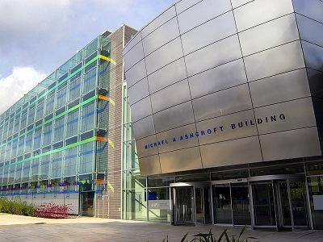

<strong>For companies at the leading edge of high-technology sectors including aerospace, defence and healthcare, effective university research collaborations are essential to business success.</strong>

In Essex, UK, companies at the forefront of fields including electronics engineering and communications technologies are engaging in high-value collaborations with nearby world-class universities – in Cambridge, London and Essex itself. These research relationships are important for professional networking and collaboration. 
<blockquote>
‘We work closely with universities like University College, London and Queen Mary College. We have 300 scientists and engineers in Chelmsford, Essex, who depend on professional networking and collaboration with colleagues and customers. The proximity of London and Cambridge, and their world-leading research universities, is vital to their work.’

Dr Trevor Cross, Group Chief Technology Officer, e2v
</blockquote><h3>Proximity to world-leading high-technology academic research…</h3>
And by any standards, companies in Essex are well positioned to access research excellence. From the county, no less than three of the world’s top-ten ranked universities are easily accessible: the University of Cambridge, Imperial College London and University College London [1]. All three excel in high-technology related research, featuring amongst the UK’s top six academic institutions for research in engineering, computer science and information technology disciplines (Research Excellence Framework (REF) 2014) [2] [3].
<table border='0' cellpadding='3' cellspacing='0' style='width: 100%;'><caption>
 
</caption><tbody><tr bgcolor='#307b33'><td style='text-align: center;'> </td><td style='text-align: center;'><strong>University of 			Cambridge</strong></td><td style='text-align: center;'><strong>Imperial College 			London</strong></td><td style='text-align: center;'><strong>University College 			London</strong></td></tr><tr bgcolor='#000000'><td style='text-align: center;'>World University Rankings (1)</td><td style='text-align: center;'> </td><td style='text-align: center;'> </td><td style='text-align: center;'> </td></tr><tr><td style='text-align: center;'>Overall World Ranking</td><td style='text-align: center;'>3 (joint)</td><td style='text-align: center;'>8</td><td style='text-align: center;'>7</td></tr><tr bgcolor='#000000'><td style='text-align: center;'>UK Research Rankings (2)</td><td style='text-align: center;'> </td><td style='text-align: center;'> </td><td style='text-align: center;'> </td></tr><tr><td style='text-align: center;'>Computer Science &amp; Information</td><td style='text-align: center;'>6</td><td style='text-align: center;'>3</td><td style='text-align: center;'>1</td></tr><tr bgcolor='#e3e3e3'><td style='text-align: center;'>Aeronautical, Mechanical,  			Chemical &amp; Manufacturing 			Engineering</td><td style='text-align: center;'>1</td><td style='text-align: center;'>2</td><td style='text-align: center;'>6U</td></tr><tr><td style='text-align: center;'>Electrical &amp; Electronic Engineering,  			Metallurgy &amp; Materials</td><td style='text-align: center;'>1</td><td style='text-align: center;'>3</td><td style='text-align: center;'>6</td></tr><tr bgcolor='#e3e3e3'><td style='text-align: center;'>General Engineering</td><td style='text-align: center;'>2</td><td style='text-align: center;'>4</td><td style='text-align: center;'>6</td></tr></tbody></table>
  Within the county, the University of Essex is ranked amongst the top 20 UK universities for research excellence [3]. It specialises in key high-technology disciplines including information and communications technology, computer science, electronic engineering and big data analytics.  The university is also home to the Centre for Assisted Living Technologies, the Institute for Analytics and Data Science and the UK Data Archive.

Anglia Ruskin University also has three campuses in Essex.  The IT Research Institute undertakes high-technology research in areas including medical informatics, intelligent systems and Big Data. Other research specialisms include electronics, telecommunications engineering and medical technology.
<h3>Complemented by high levels of industrial research and development… </h3>
The East of England benefits from the highest level of Research and Development expenditure of any UK region [4], thanks in no small part to Essex-based companies.

<a href='http://investessex.co.uk/studies/case-studies/bae-systems' target='_blank'>BAe Systems</a>, <a href='http://investessex.co.uk/studies/case-studies/raytheon-company' target='_blank'>Raytheon</a>, <a href='http://investessex.co.uk/studies/case-studies/selex-galileo' target='_blank'>Selex ES</a>, <a href='http://investessex.co.uk/studies/case-studies/e2v-technologies' target='_blank'>e2V</a> and <a href='http://investessex.co.uk/studies/case-studies/ford1' target='_blank'>Ford</a> all have significant research, design and development facilities in the county, undertaking high-technology research across the aerospace, defence, healthcare and automotive sectors. Expertise within Essex’s high-technology cluster encompasses information and communication technologies, control systems, semi-conductor technology, sensors, imaging, advanced and autonomous robotics and precision design and manufacture.  These capabilities intersect with specific areas of excellence at nearby universities, in Essex, Cambridge and London.
<h3>A dynamic environment for high technology businesses…</h3>
Through a combination of world-class academic research and industrial R&amp;D, Essex is providing a dynamic environment for research-driven business across a range of high-technology industry sectors.
<h3>FIND OUT MORE</h3>
Contact <a href='http://www.investessex.co.uk/' target='_blank'>INVEST Essex</a> to find out more about the Cambridge-Essex UK High-Technology Cluster.

[1] QS World University Rankings, 2015/16 <a href='http://www.topuniversities.com/university-rankings/world-university-rankings/2015' target='_blank'>http://www.topuniversities.com/university-rankings/world-university-rankings/2015</a> [2] The Complete University Guide: <a href='http://www.thecompleteuniversityguide.co.uk/league-tables/rankings' target='_blank'>http://www.thecompleteuniversityguide.co.uk/league-tables/rankings</a> [3] Research Excellence Framework 2014:<a href='http://www.ref.ac.uk' target='_blank'> http://www.ref.ac.uk </a> [4] ONS, 2011
<table border='0' cellpadding='0' cellspacing='0' style='width:667px;' width='667'><tbody><tr></tr></tbody></table>