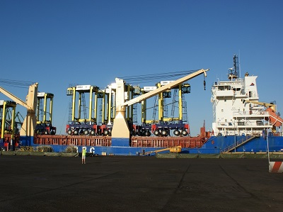

The Port of Tilbury is the latest Essex port to offer a container weighing solution for UK exporters. The port has made significant investment, in its straddle carriers to stack and move containers, and to meet the increase in container business at the terminal.

The London Container Terminal (LCT) at the <a href='http://investessex.co.uk/studies/place-studies/port-of-tilbury' target='_blank'>Port of Tilbury</a> is now ready to receive export cargo with a solution in place to comply with the SOLAS (Safety of Life at Sea) regulations that came into force this month.
<blockquote>
“With this further investment we continue to secure Tilbury’s position as a key shipping and distribution location with unrivalled access to London and the South East of England.  LCT is one of the most efficient UK ports for handling containers, bringing benefits to our customers with improved turnover of vessels and road side trucks. Tilbury handles in excess of half a million containers each year, and is the only UK port truly servicing both deep sea and short sea customers. Customers also benefit from access to Europe’s largest portside chill store which NFT opened at the port this year.”

 Stuart Wallace, Divisional Director, Forth Ports
</blockquote>
The SOLAS (Safety of Life at Sea) regulations will require the weighing and certification of cargo being loaded into every shipping container before being delivered to a shipping line/port for loading to a vessel. In addition it will no longer be permitted to assume weight based on previous or standard manufacturing weights.
<blockquote>
“Recognising the importance of compliance and continuity of service for our customers, we are pleased to confirm that we will provide a weighing service to ensure our customers have a solution to the amended regulations, allied with safeguarding those engaged in the movement and transport of containerised goods.”

 Stuart Wallace, Divisional Director, Forth Ports
</blockquote><h3>Essex Ports Providing A Solution For The New Regulations</h3>
Investments in container weighing services at UK ports have ensured that British businesses can continue trading now the new regulations have started. The objective of the regulations is to prevent serious accidents at sea where a ship’s stability is compromised by wrongly declared cargo weight.

Both DP World London Gateway and the Port of Tilbury have implemented scalable solutions to weigh containers shortly after arrival and provide the Verified Gross Mass (VGM).
<blockquote>
“We are pleased to confirm that our customers at the London Container Terminal will have a weighing solution to the amended regulations being enforced on 1 July. Following consultation with our key export customers, ports will now weigh those boxes requiring VGM as part of the overall operational flow, minimising any impact on operational procedures at the interchange points. The port of loading is recognised as the most cost effective to identify the VGM, where this has not been provided earlier in the supply chain, ensuring a seamless change of modality from truck or train to sea.”

Stuart Wallace, Divisional Director, Forth Ports
</blockquote>
DP World London Gateway has also invested in new equipment which will provide a solution for the new regulations. It will still be possible for shippers to provide a certified VGM through electronic messaging prior to arrival at the port if preferred.
<h3>About DP World London Gateway </h3>
Located just 25 miles from central London, <a href='http://investessex.co.uk/studies/place-studies/london-gateway-port' target='_blank'>DP World London Gateway</a> has 16 million consumers within 50 miles enabling ships to enter the UK closer to the key areas of consumption such as London, Birmingham and Manchester. The port benefits from accessibility via sea, road and rail and has also developed innovative technology to ensure it remains open in bad weather.
<h3>About The Port of Tilbury</h3>
The <a href='http://investessex.co.uk/studies/place-studies/port-of-tilbury' target='_blank'>Port of Tilbury</a> is one of the largest deep water ports on the River Thames and the closest port to the City of London. The Port of Tilbury specialises in construction transportation to London, import/export of timber, distribution of paper, and production and distribution of recycled products.

Source: [<a href='http://www.investessex.co.uk/studies/place-studies/london-gateway-port/' target='_blank'>DP World</a>] [<a href='https://sprengthomson.com/london-container-terminal-grangemouth-container-terminal-offer-weighing-solution-exporters/' target='_blank'>Forth Ports</a>]
<blockquote>
“With this further investment we continue to secure Tilbury’s position as a key shipping and distribution location with unrivalled access to London and the South East of England.”

Stuart Wallace, Divisional Director, Forth Ports
</blockquote>