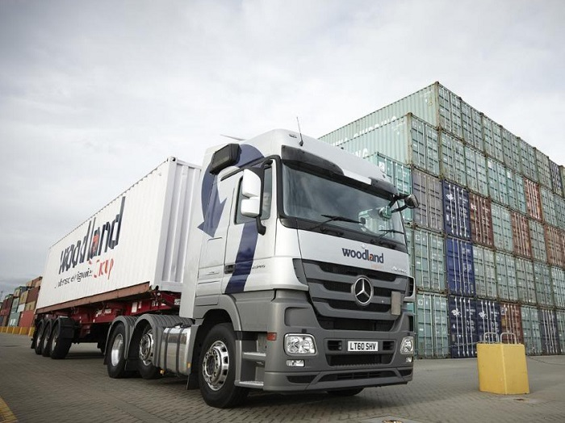
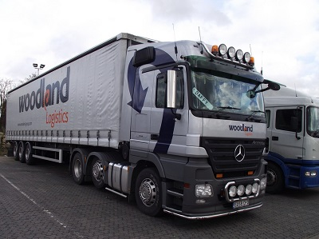

With its strong multimodal transport links, world-class educational institutions and close proximity to London, Essex is fast becoming a hot spot for logistics businesses looking to expand or relocate.

Freight forwarding company, the Woodland Group, has had its HQ in Essex for almost 30 years, and attributes a large part of its success to what the region has to offer.

Since its beginnings as a five-man team in Basildon 28 years ago, the Woodland Group has flourished into an international business, employing around 600 people worldwide – including more than 200 from within the Essex area.
<h3>The region's multimodal transport links a big advantage</h3>
So what’s kept the Woodland Group loyal to Essex throughout its expansion? With offices across the UK as well as in the USA, Ireland and Hong Kong, what benefits does being based in Essex bring to a logistics company like Woodland?

For companies such as Woodland a big advantage is the region’s multimodal transport links.
<blockquote>
“Being a business heavily focused on logistics, good transportation links play a major factor in our success.”

In Essex, we have great road, air, sea and rail links right on our doorstep. From the London Gateway and Tilbury ports, to Stanstead, Gatwick and Heathrow airports just along the M25, by being located in Essex we can offer our customers a service that is quick and cost effective.”

 Darren Brundell, Marketing Manager, Woodland Group
</blockquote><h3>Providing skills required by logistics companies</h3>
Essex also offers a diverse workforce for logistics companies, both skilled and unskilled.

And, with educational establishments such as the University of Essex and South Essex College proactively supporting the sector’s development, logistics companies can benefit from ongoing skills development, be it through apprenticeships and graduate recruitment or the training and upskilling of existing employees. 
<blockquote>
“We have run an apprenticeship scheme for the last two years, which has proved to be very successful in terms of helping us recruit and retain the next generation of logistics industry talent.

We have also just started working closely with local education providers to set up a bespoke logistics program for our staff, as part of our ongoing aim to deliver the best possible training.

Having places of education near to our business, that are willing to work closely with our industry and understand the skills required - not just today, but in the future - is crucial to our continued success, and so we’re working closely with Essex’s education providers to achieve just that.”

 Darren Brundell, Marketing Manager, Woodland Group
</blockquote><h3>Establishing the county as a major hub for international trade</h3>
So, what does the future hold for the Woodland Group and for Essex’s logistics sector as a whole? According to Woodland Logistics the region’s businesses are in a ‘great position’ to move forward.
<blockquote>
“We are seeing a lot of the small and medium sized enterprises (SME) that we work with growing in size, which is fantastic. We continue to help them where we can so we can mutually benefit from growth in the future.

Because of our location, we can offer businesses a fast, efficient service, often with significant cost savings due to the transport links from our warehouse across the UK and internationally, too.

Keeping our headquarters here in Chelmsford, Essex, gives us the edge and enables us to live up to the world-leading reputation that we’ve worked so hard to achieve.”

 Darren Brundell, Marketing Manager, Woodland Group
</blockquote>

The Woodland Group is a great example of a logistics company achieving big things from its base in Essex, using the benefits the county has to offer to ensure its continued success and growth, now and in years to come.
<h3>FIND OUT MORE</h3>
Contact <a href='../index.html' target='_blank'>INVEST Essex</a> to find out more about the advantages of UK Multimodal Gateway: Essex for your logistics or distribution operation.

Source [<a href='http://www.thewholesaleforums.co.uk/threads/spot-the-woodland-truck.174595/' target='_blank'>Woodland Group</a>]
