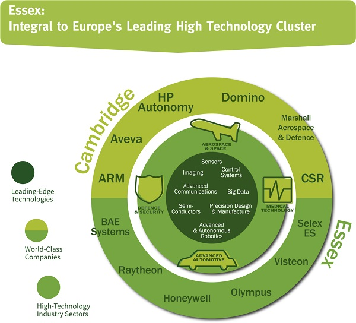
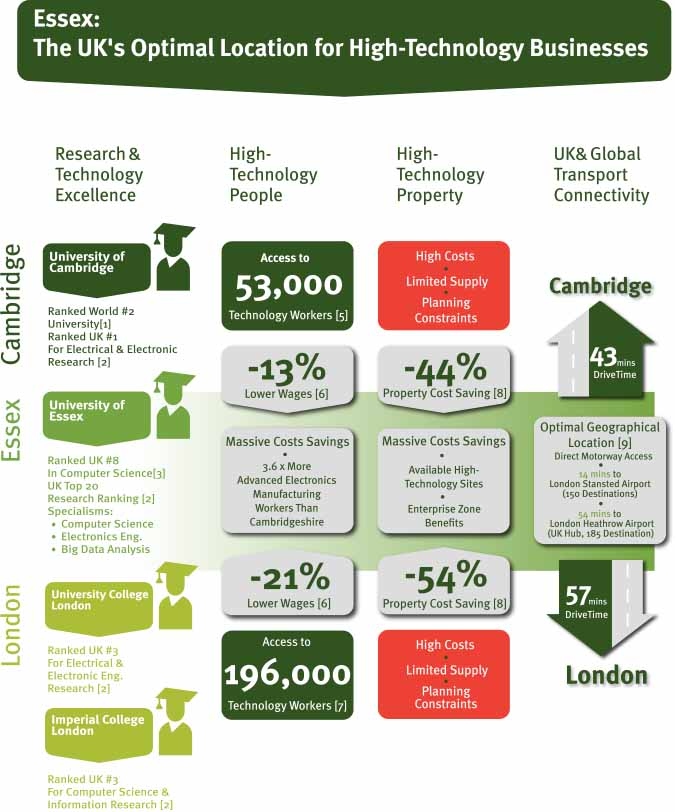

<strong>Sources:</strong>

[1]THE World University Rankings, 2015 [2] UK Research Excellence Framework  (REF), 2014 [3] Academic Ranking of World Universities, 2014 [4] Oxford Economics/London &amp; Partners, 2015 [5] Cambridge Network, 2015 [6] ONS/Nomis, 2015 [7] Oxford Economics/London &amp; Partners, 2015 [8] Colliers, 2015 (Office Rents) [9] Google Maps, 2015
<h3>FIND OUT MORE</h3>
Contact <a href='../index.html' target='_blank'>INVEST Essex</a> to find out more about the Cambridge-Essex UK High-Technology Cluster.
