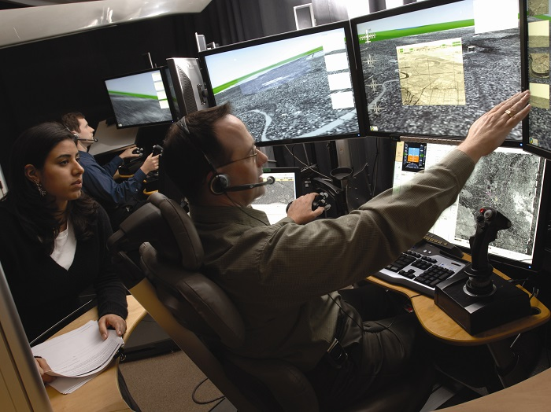

<strong>For high technology companies, maintaining a competitive edge requires an innovative approach to education and skills development. In Essex, employers and education providers are working together to show how it’s done.</strong>

From communications systems to medical devices and more, businesses have become increasingly reliant on high technology, demanding new solutions to meet challenges within their sector.

In order to fulfil this demand, high-technology companies face a challenge: not only to keep developing new innovations, but to keep developing the skills of the people who work for them too, now and for the future.

<a href='http://www.raytheon.co.uk/' target='_blank'>Raytheon</a> – an Essex-based technology and innovation leader specialising in defence, civil government and cybersecurity solutions, has found this to be the case... 
<blockquote>
“The ability to attract and retain appropriately skilled employees is a strategic imperative to delivering competitive advantage,” [1]

Suzanne Jude, Head of Strategy, Raytheon
</blockquote>
And, in Essex, it’s a challenge education providers and high-technology businesses are rising to, together.
<h3>Collaborative training and education…</h3>
As the high-technology industry bridges multiple market sectors, from defence and aerospace to healthcare and automotive, a collaborative approach to training and education is vital.

The <a href='http://essexpartnership.org/content/essex-employment-and-skills-board' target='_blank'>Essex Employment and Skills Board (ESB),</a> chaired by Raytheon’s Suzanne Jude, was set up for this purpose, bringing together employers, educators and local government to give Essex ‘a real voice in shaping skills provision.’ [2]

But what other educational resources does Essex offer? And how does their provision help high-technology businesses in the county?
<h3>Specialist technology education provision…</h3>
Essex is home to multiple, high-ranking education establishments that have forged strong links with high-technology industry, including the UK’s first college of advanced technology - <a href='http://www.procat.ac.uk/' target='_blank'>PROCAT</a> (Prospects College of Advanced Technology).

The <a href='http://www.sircharleskaoutc.com/' target='_blank'>Sir Charles Kao University Technical College</a> in Harlow combines practical, academic education and training linked to the workplace, and has built its curriculum around <a href='http://www.sircharleskaoutc.com/about/specialisms/' target='_blank'>technical specialisms</a> such as Smart Environments and Medical Technology.

And, through their close links with Essex-based businesses, both colleges offer adult learning opportunities, industry-linked projects, apprenticeships and traineeships, relevant to the needs of local employers such as Raytheon.
<blockquote>
“The strength of Essex’s further education providers is that they are responsive to employers.

Both PROCAT and the Sir Charles Kao UTC put employers at the heart of their delivery. This means taking time to understand what works best and responding accordingly.”

Suzanne Jude, Head of Strategy, Raytheon
</blockquote><h3>And high-ranking research universities…</h3>
The region’s higher education providers align their teaching specialisms with the requirements of Essex’s high-technology businesses, too.

The <a href='http://www.essex.ac.uk/' target='_blank'>University of Essex</a> – a world top 2% ranked university [3] – <a href='http://www.essex.ac.uk/study/pg/masters/default.aspx' target='_blank'>offers post-graduate courses</a> in areas including Telecommunication and Information Systems and Cloud Computing, at its School of Computer Science and Electronic Engineering.

The University is also a ‘UK top 20’ university for Research Excellence [4], with specialisms in a range of key high-technology disciplines, such as Big Data, Radio, Radar and Electromagnetics, and Optical and Semiconductor Devices.
<h3>Skills for success</h3>
With its collaborative approach to meeting skill requirements, leading educational establishments and proximity to London and Cambridge, Essex means business for high-technology companies such as Raytheon...
<blockquote>
“From our experience of working in other parts of the country and internationally, Essex has developed a truly innovative, evidence-based, responsive approach to skills. 

This gives us the confidence that a future workforce is being developed, our needs are understood and that employers have a central role.”

Suzanne Jude, Head of Strategy, Raytheon
</blockquote><table cellpadding='0' cellspacing='0'><tbody><tr><td height='80'><table cellpadding='0' cellspacing='0' width='100%'><tbody><tr><td><h3>FIND OUT MORE</h3>
Contact <a href='../index.html' target='_blank'>INVEST Essex</a> to find out more about the Cambridge-Essex UK High-Technology Cluster.
</td></tr></tbody></table></td></tr></tbody></table>
<strong>Sources:</strong> [1] Interview with Suzanne Jude, Raytheon, February 2016 [2] Essex Partnership: Essex Employment and Skills Board: <a href='http://essexpartnership.org/content/essex-employment-and-skills-board'>http://essexpartnership.org/content/essex-employment-and-skills-board</a> [3] Times Higher Education:  <a href='https://www.timeshighereducation.com/world-university-rankings/2015/reputation-ranking#!/page/0/length/25'>https://www.timeshighereducation.com/world-university-rankings/2015/reputation-ranking#!/page/0/length/25</a> [4] Times Higher Education: <a href='https://www.timeshighereducation.com/sites/default/files/Attachments/2014/12/17/x/o/z/sub-14-01.pdf'>https://www.timeshighereducation.com/sites/default/files/Attachments/2014/12/17/x/o/z/sub-14-01.pdf</a>) 
