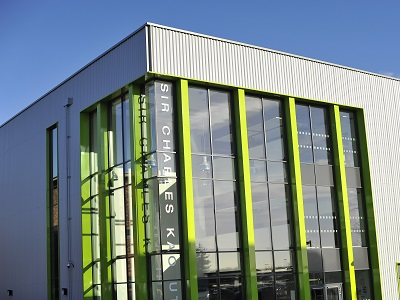

It’s been more than 118 years since Essex’s reputation for technology and innovation was established, with Guglielmo Marconi – the inventor of the radio – opening his first factory in Chelmsford. [1]

Today, that reputation holds strong, with factors such as strong transport links, world-class education providers and proximity to London and Cambridge continuing to attract world-leading high-technology companies, including <a href='http://investessex.co.uk/studies/case-studies/e2v-technologies' target='_blank'>e2v</a>.

From creating the image sensors that took the first ever close-up images of Pluto, to providing the x-ray source in more than 90% of the world’s cancer radiotherapy machines, Essex-based e2v’s expertise is making an impact across the globe.
<h3>Developing skills for high-technology industry</h3>
Since its establishment in 1947, the company has grown to employ almost 1,000 people in the county, as well as across Europe, North America and Asia. But e2v has stayed loyal to its Essex routes.

Why? Well, according to Adam Jones, e2v’s Global Head of Recruitment, the county’s educational establishments and their commitment to developing skills for high-technology industry plays a key role.
<blockquote>
“The very nature of our business is producing innovative solutions for our customers.To be able to do this we have to attract and retain people with the skills we need, to produce the outstanding results our customers need.

We couldn’t have produced generation after generation of world-class engineering expertise without exceptional education, both for local schoolchildren and future apprentices, but crucially, as partners in our successful apprenticeship schemes.”

Adam Jones, Global Head of Recruitment, e2v
</blockquote><h3>Outstanding education providers</h3>
With its links to Essex’s colleges and universities, e2v runs an award-winning apprenticeship scheme, in partnership with one of its local education partners - Chelmsford College of Further Education.

The apprenticeship scheme, according to Adam, is one of the longest-running in the county and encourages new engineering talent into the company each year.
<blockquote>
“We encourage the relationship between education and on the job training. Essex is lucky to have forward-looking colleges such as PROCAT (Prospects College of Advanced Technology) and the Sir Charles Kao UTC. They’ve built their curriculums specifically around the needs of local employers and have invested heavily to provide world class facilities, plus two strong universities.”

Adam Jones, Global Head of Recruitment, e2v
</blockquote>
The region is also home to the Essex Employment and Skills Board, a strategic group of large employers, SMEs, business membership groups, colleges, universities and local government. [2]

Adam Jones is the Board’s sector lead for the engineering and manufacturing sector.
<blockquote>
“We are prepared to think the unthinkable and produce the creative solutions that can make a real difference: the solutions that will allow the high-technology sector in Essex to continue to innovate and thrive.” 

Adam Jones, Global Head of Recruitment, e2v
</blockquote><h3>The UK's optimal location for high-technology businesses</h3>
As well as outstanding education providers who are working closely with high-technology employers, Essex’s technology history and geographical location – just 30 minutes from London with excellent global transport links - are also factors in e2v’s loyalty to the county.
<blockquote>
“Essex has a heritage in high-technology, which is supported to this day by good local education and skills, excellent transport links and data connectivity. It’s also an attractive area offering residents a great place to live and work.

Combined, these factors help us to retain and attract top talent from both inside and outside the county, and from overseas. We are proud to be an Essex success story and we work hard to maintain our strong links with the local community.”

Adam Jones, Global Head of Recruitment, e2v
</blockquote><h3>FIND OUT MORE</h3>
Contact <a href='../index.html' target='_blank'>INVEST Essex</a> to find out more about the Cambridge-Essex UK High-Technology Cluster.

<strong>Sources:</strong> [1] Invest Essex: Birthplace of Radio <a href='http://investessex.co.uk/studies/case-studies/birthplace-of-radio' target='_blank'>http://investessex.co.uk/studies/case-studies/birthplace-of-radio/</a> [2] Essex Employment and Skills Board: <a href='http://essexpartnership.org/content/essex-employment-and-skills-board' target='_blank'>http://essexpartnership.org/content/essex-employment-and-skills-board</a>  
