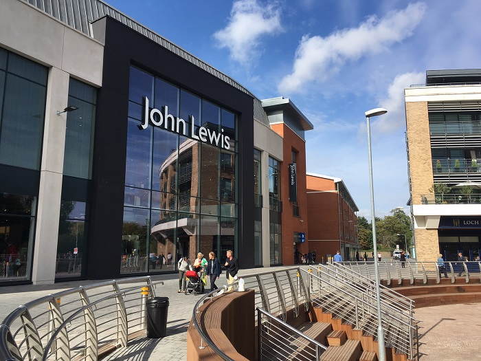

Retailer John Lewis is the latest company to show confidence in the Essex market opening its first store in the county at the new £150m Bond Street shopping development in Chelmsford.

John Lewis has invested £18m in the three storey department store which includes 90,000 sq ft of selling space and created 300 jobs.
<blockquote>
'Today marks a very exciting time for John Lewis and we're delighted to open the doors to our first shop in Essex. It's one of our most modern shops to date and brings together the very best of John Lewis' products and services.

Our new team of Partners have worked incredibly hard to get us to this stage and I'm very proud of everyone involved. Together with the Bond Street development, this John Lewis shop will create a new retail and leisure offer that ensures Chelmsford has something for everyone.'

 Laura Rawstron, Branch Manager, John Lewis Chelmsford
</blockquote><h3>Bond St development</h3>
The Bond Street development will elevate Chelmsford to a ‘Premium Major Centre’ to take it alongside other major shopping destinations such as York, Maidstone, Solihull and Tunbridge Wells.

The John Lewis department store is at the forefront of the new 300,000 sq ft development delivered by developers Aquila Holdings.

Other stores opening at the new Bond Street scheme include…
<ul><li>Cath Kidston</li><li>Fat Face</li><li>Hotel Chocolat</li><li>Jack Wills</li><li>Oasis</li><li>Tag Heuer  </li><li>White Stuff</li><li>L’Occitane</li></ul>
Restaurants including Byron Burgers, Coast to Coast and Las Iguanas are also set to open in future weeks and a multiscreen Everyman Cinema is due to open in December.
<h3>The biggest business base in Essex</h3>
The UK regional office market is also seeing steady levels of demand with Chelmsford receiving a surge of investor confidence. With grade A office space let between approx. £25-£27sq ft, as opposed to £62.50 - £115 per sq ft in London, Chelmsford is proving to be a very viable and attractive option to businesses looking to be within close proximity of the capital. According to consumer insight experts, Experian, Chelmsford is the biggest business base in Essex.

The financial sector, business administration and support services are well represented with International Financial Data Services, QBE, Royal &amp; Sun Alliance, Royal Bank of Scotland, MS Amlin, Cofunds &amp; Coutts, whilst science and technology companies such as e2v and BAE Systems take advantage of the city’s close position to Higher Education institutions as well as easy access to London, Cambridge and Europe.
<h3>City of Chelmsford</h3><ul><li>The UK’s newest city has been singled out as a prime spot for inward investment and last year retained two major businesses which relocated their headquarters in Chelmsford – MS Amlin insurers and US owned cosmetics company, Benefit</li><li>According to property investors and developers Aquila Holdings, Chelmsford, the UK’s newest city, currently has 8,000 new homes planned or under construction</li><li>Chelmsford is home to the busiest railway station in the East of England with over 7m passengers a year</li><li>It has a thriving economy with over 11,000 businesses and 80,000 jobs contributing £3.4 billion to the national economy</li></ul>
Source [<a href='http://www.essexchronicle.co.uk/Date-confirmed-start-work-John-Lewis-Bond-St/story-25754712-detail/story.html' target='_blank'>Essex Chronicle</a>] [<a href='http://www.johnlewispartnership.co.uk/media/press/y2016/press-release-29-september-2016-essex-welcomes-first-john-lewis-as-chelmsford-shop-opens.html' target='_blank'>John Lewis</a>]
