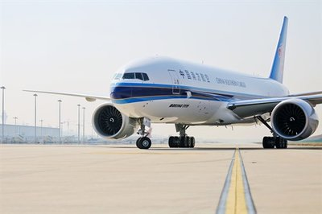

London Stansted Airport has seen passenger numbers rise to over 24 million, a new all-time high, and an increase of 8.2% over the previous 12 month period. This is the first time this volume of passenger numbers has been reached since 2007.

The UK’s fourth busiest airport also had its busiest ever October as more than 2.1 million passengers passed through the terminal, up 6% over the same month last year and the 31st consecutive month of passenger growth.
<blockquote>
“We’re delighted to be able to announce we’ve reached another two major passenger milestones at Stansted this month.

When MAG first acquired Stansted, we stated our priority was to return the airport to growth so to not only set another monthly record for the busiest ever October but to actually pass the all-time annual passenger high in just three and a half years is a fantastic achievement by everyone at Stansted.

We’ve worked very hard with our airline partners, particularly with Ryanair who have grown significantly at Stansted by adding lots of new routes and increased frequencies. We want to build on this success as we try and offer even more choice as we add new airlines and more destinations to the route network available from the airport.”

 Andrew Cowan, CEO, London Stansted Airport
</blockquote><h3>Cargo services development</h3>
Cargo volumes at the airport also continued to rise with a 2.8% increase in October over the same month last year. Annual figures show over 250,000 tonnes of cargo were shipped through London Stansted Airport in the last year up 6.9% on the previous 12 months.

This figure is set to increase again after Turkish Airlines joined London Stansted Airport’s growing cargo operation last month with its new services to Istanbul. The airline joins international heavyweights that include China Southern Airlines and Qatar Airways as the fifth carrier to be added to the cargo network since MAG (Manchester Airports Group) took over ownership of London Stansted Airport in March 2013.
<blockquote>
“Stansted is one of the largest cargo hubs in Britain with more than £9.5bn worth of cargo transported every year. With spare runway capacity to support significant growth and additional economic activity, MAG’s ambition is to develop Stansted into the premier scheduled freighter airport for the UK.

The airport sits at the heart of the London-Stansted-Cambridge growth corridor, and with the region booming and London’s economic activity shifting towards the east, Stansted is ideally placed to support businesses trading internationally and looking to compete in the global market place.”

Conan Busby, Business Development Manager, MAG Cargo
</blockquote><h3>Business advantage of London Stansted Airport</h3>
London Stansted Airport is the UK’s 3rd largest cargo airport and offers services to every major continent via a diverse portfolio of airlines and their extensive networks. The airport connects UK commerce with the world, ranging from roses to machine components, luxury cars to helicopters.
<blockquote>
“Looking ahead, we have already invested over £150 million to improve passenger facilities but with runway capacity available that means we could add another 20 million passengers a year we are now looking at how we can increase our terminal capacity, including new schemes which will give us more terminal space, improved passenger services as well as additional aircraft parking stands.”

 Conan Busby, Business Development Manager, MAG Cargo
</blockquote>
As new cargo and passenger services develop at London Stansted Airport, and other London airports reach capacity, the airport is set to further grow and increase its UK freight and logistics offer. Significant land availability also allows for future development.
<h3>London-Stansted-Cambridge economic corridor</h3>
The thriving catchment area is part of the growing and increasingly successful London-Stansted-Cambridge economic corridor. The area has strong infrastructure links to the rest of the UK and Europe and close proximity to London, Europe’s no.1 finance hub. London Stansted Airport has more scheduled connections to Europe than any other airport in the world.

See here for more information on <a href='http://investessex.co.uk/studies/place-studies/london-stansted-airport' target='_blank'>London Stansted Airport</a>.

Source [<a href='http://www.stanstedairport.com/about-us/media-centre/press-releases/london-stansted-airport-sets-all-time-passenger-record/'>London Stansted Airport</a>]
