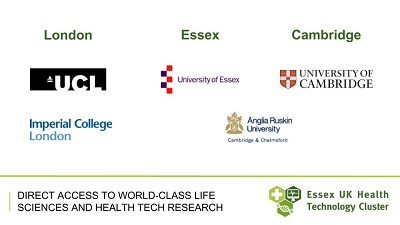

<strong>Essex-based life science and health technology companies can access world-class universities and leading-edge research…</strong>

Rapid advances in life science and health technologies are being driven by partnerships between industry and universities, as novel research is applied to solving real life problems. And businesses located in Essex – between Cambridge and London – are ideally positioned to access world-leading university research.

According to the latest university ranking, the cities of Cambridge and London together boast 3 of the world’s top-10 universities (based on overall rankings) and 3 of Europe’s top 6 institutions for life sciences and medicine. [1]
<table align='center' border='0' cellpadding='1' cellspacing='0' style='width: 450px;'><tbody><tr bgcolor='#307b33'><td style='text-align: center;'><strong>University Rankings [1]</strong></td><td style='text-align: center;'><strong>University of Cambridge</strong></td><td style='text-align: center;'><strong>Imperial College London</strong></td><td style='text-align: center;'><strong>University College London</strong></td></tr><tr bgcolor='#FEF9E7'><td style='text-align: center;'>Overall World Ranking</td><td style='text-align: center;'><strong>3</strong> (joint)</td><td style='text-align: center;'><strong>8</strong></td><td style='text-align: center;'><strong>7</strong></td></tr><tr bgcolor='#D5F5E3'><td style='text-align: center;'>Life Sciences &amp; Medicine (European Ranking)</td><td style='text-align: center;'><strong>1</strong></td><td style='text-align: center;'><strong>2</strong></td><td style='text-align: center;'><strong>6</strong></td></tr></tbody></table><h3>Prestigious Research Institutes and Innovation Centres…</h3>
Essex’s location within the UK’s life sciences ‘golden triangle’ (London-Oxford-Cambridge) also provides businesses with easy access to world-renowned collaborative Research Institutes and Innovation Centres. These include the Wellcome Trust Sanger Institute [2], which is pushing the boundaries of genomic research, The Francis Crick Institute [3], Europe’s largest centre for biological research, and the new, highly innovative £55 million Stevenage Bioscience Catalyst [4], which enables biotech, pharma and medtech businesses to draw upon world-leading expertise, networks, academic support and scientific facilities.

Cambridge, London, and nearby Oxford also host 5 of the UK’s 6 Academic Health Science Centres [5] - joint NHS-University ventures supporting the translation of academic research into healthcare solutions.
<h3>And Healthcare and ICT expertise within Essex’s own universities…</h3>
Ranked amongst the top 2% of world universities [6], the University of Essex specialises in technologies for the management and transfer of big data, and translational research in the fields of biomedical and health sciences.  Also in Essex, Anglia Ruskin University’s IT Research Institute specialises in medical informatics, imaging, ‘big data’ and the Internet of Things [7].  Anglia Ruskin places great importance on MedTech collaborations and is working with partners to create three MedTech campuses across the county [8].
<h3>Providing a thriving culture of research translation and collaboration…</h3>
Given this easy access to world-leading research, and the significance of the wider South East England life sciences cluster, [9] it should come as no surprise that Essex is proving an attractive location for established life sciences businesses, as well as spin off companies from both Cambridge and London Universities.
<h3>Find out more</h3>
Contact <a href='../index.html' target='_blank'>INVEST Essex</a><strong> </strong>to find out more about the Essex UK Health Technology Cluster.

<strong>Sources:</strong>

[1] QS World University Rankings, 2015/16 [2] <a href='http://www.sanger.ac.uk/' target='_blank'>www.sanger.ac.uk</a>   [3] <a href='https://www.crick.ac.uk/' target='_blank'>www.crick.ac.uk</a>  [4] <a href='http://www.stevenagecatalyst.com/' target='_blank'>www.stevenagecatalyst.com</a>  [5] <a href='https://www.gov.uk/government/news/top-nhs-and-university-alliances-recognised-by-department-of-health' target='_blank'>https://www.gov.uk/government/news/top-nhs-and-university-alliances-recognised-by-department-of-health</a>  [6] THE World University Rankings [7] <a href='http://www.anglia.ac.uk/anglia-ruskin-it-research-institute' target='_blank'>http://www.anglia.ac.uk/anglia-ruskin-it-research-institute</a>  [8] <a href='http://www.medtechcampus.com' target='_blank'>http://www.medtechcampus.com</a>  [9] <a href='http://www.us.jll.com/united-states/en-us/Documents/Life-Sciences/2014-global-life-sciences-report-JLL.pdf' target='_blank'>http://www.us.jll.com/united-states/en-us/Documents/Life-Sciences/2014-global-life-sciences-report-JLL.pdf</a>
