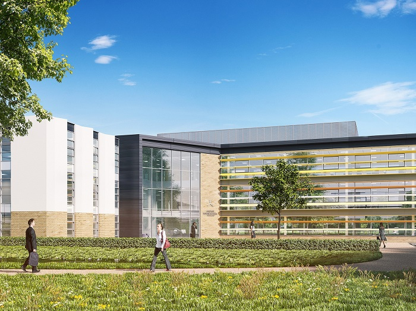

===
heading: £20m funding for Airport Business Park Southend
url: GBP20m-funding-for-airport-business-park-southend
sectors:
  - uk-multimodal-gateway-essex 
pubdate:03/02/2017
Author:Anastasija Tomm
thumb://investessex.co.uk/uploads/blog/31314875172_3d7e99fef0_h_165.jpg
heroimg:
contact:Robert Edge
===

A new £150 million business park situated next to London Southend Airport has received nearly £20m government funding for a new innovation centre project. The funding will enable an innovation centre to be built at Airport Business Park Southend (ABPS). The project is expected to attract occupiers from the medical, aviation, advanced engineering and manufacturing sectors.

The funding is part of a £102 million cash injection for capital projects for the South East Local Enterprise Partnership (SELEP). Southend-on-Sea Borough Council has secured nearly one-fifth of the entire allocation across the SELEP area.
<blockquote>
“This is fantastic news and further proof that Southend-on-Sea continues to punch above its weight when it comes to bidding for external funding.

For the Borough to receive nearly one-fifth of all available funding for the South East of England is a great achievement and testament to the hard work that we have been doing to make this development a reality”. 

Cllr John Lamb, Leader, Southend-on-Sea Borough Council
</blockquote><h3>Networking and collaboration opportunities</h3>
The modern flexible office environment at the innovation centre will enable young and growing businesses space in which to locate and will provide a networking and collaboration opportunity for businesses in the medical, aviation, advanced engineering and manufacturing sectors as well as the whole business community.

 

 
<blockquote>
“The innovation centre will be the heart of the Business Park and will create an exciting modern environment for young and growing businesses to locate into flexible and serviced office and workshop space which can grow with their business”.

Cllr John Lamb, Leader, Southend-on-Sea Borough Council
</blockquote><h3>Allocated land usage and opportunities for overseas investors</h3>
The site of Airport Business Park Southend (ABPS) is located to the north-west corner of London Southend Airport and comprises of circa 52 acres of developable land.  This will be split between office, manufacturing use and retail/hospitality…
<ul><li>28.6 acres office use (B1)</li><li>18.2 acres manufacturing use (B2)</li><li>2.6 acres ancillary uses including retail and a hotel</li></ul>
Kemsley LLP has been appointed by Henry Boot Developments Limited to market ABPS, a joint venture with Southend Borough Council. Kemsley LLP, together with local agents Dedman Gray, will be working closely with Henry Boot Developments, Southend Borough Council and <a href='../index.html' target='_blank'>INVEST Essex</a> to promote this important business park to local, national and international businesses.

Kemsley LLP is a commercial partner of INVEST Essex. INVEST Essex works with UK and foreign based companies helping them settle in Essex and thrive in a location on the doorstep of London and Europe.

INVEST Essex are currently promoting this outstanding business opportunity to a range of relevant overseas investors. Utilising their extensive local and specialist networks INVEST Essex will be supporting the development of proposals and providing targeted intelligence to help inform and guide interested parties.
<blockquote>
“Our ambitious plans are a once in a generation opportunity to bring in significant private sector investment and generate thousands of new jobs in attractive, modern business premises in the area around London Southend Airport.”

Councillor Ron Woodley, Leader, Southend Borough Council
</blockquote><h3>Location advantages of London’s newest airport</h3>
London Southend Airport is the eastern gateway to London providing excellent access to Europe for business travellers and urgent freight. London Southend Airport offers important European connections without the congestion and inconvenience of a London location.

Fast road and rail links make it easy for business travellers and freight operators to reach the airport or save time on their onward journeys to London or regional destinations.

See <a href='http://investessex.co.uk/studies/place-studies/london-southend-airport?_sm_au_=iMVqs5VnFFMlmQlP' target='_blank'>here</a> for more information on London Southend Airport.

Source [<a href='http://www.southend.gov.uk/?_sm_au_=iMVqs5VnFFMlmQlP' target='_blank'>Southend-on-Sea Borough Council</a>]
